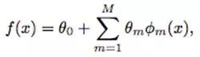
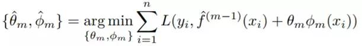
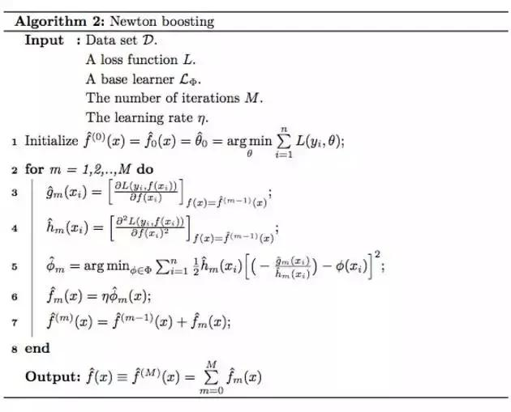
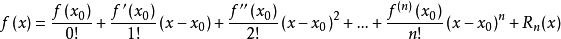

# 基本的概念

boosting 提升方法

gradient boosting 梯度提升

gradient boosting decision tree 梯度提升决策树

MART(multiple additive regression tree) 多重累加回归树

# **理解 Boosting、树方法和树提升**

boosting 拟合同一类的集成模型（ensemble model）：

其可以被写成自适应基函数模型：

多数 boosting 算法都可以看作是在每次迭代时或准确或近似地求解

## 梯度提升

## 牛顿提升

- 是梯度
- 是使用数据学习到的弱学习器
- 是经验 Hessian

- 梯度提升：是由线搜索（line search）确定的步长
- 牛顿提升： h_m(x) 是经验 Hessian

# **树方法**

cart树

# **树提升**

# 从参数空间到函数空间

## 泰勒公式

1. 定义：是一个用函数在某点的信息，描述其附近取值的公式。

2. 基本形式：

   

   其中一阶泰勒展开式就是求一阶导，二阶展开式即求二阶导。x0为已知，公式表示f(x)在x0附近的展开。 

3. GDBT或是xgb都是一个参数迭代的过程，因此这里表示一个迭代形式的泰勒函数：
    

   

   假设

   

   

   将f(x^t) 在x^(t-1)处进行展开：

   

   

# xgboost到Newton Tree Boosting

如何完整的推导xgboost(按照陈天奇slide)，并且把xgboost的推导推广到newton tree boosting

# xgboost相比于GBDT的创新之处：

传统GBDT以CART作为基分类器，xgboost还支持线性分类器，这个时候xgboost相当于带L1和L2正则化项的逻辑斯蒂回归（分类问题）或者线性回归（回归问题）。

- 传统GBDT在优化时只用到一阶导数信息，xgboost则对代价函数进行了**二阶泰勒展开，同时用到了一阶和二阶导数**。顺便提一下，xgboost工具支持自定义代价函数，只要函数可一阶和二阶求导。
- xgboost在**代价函数里加入了正则项，用于控制模型的复杂度**。正则项里包含了树的叶子节点个数、每个叶子节点上输出的score的L2模的平方和。从Bias-variance tradeoff角度来讲，正则项降低了模型的variance，使学习出来的模型更加简单，防止过拟合，这也是xgboost优于传统GBDT的一个特性。
- **Shrinkage（缩减），相当于学习速率（xgboost中的eta）**。每次迭代，增加新的模型，在前面成上一个小于1的系数，降低优化的速度，每次走一小步逐步逼近最优模型比每次走一大步逼近更加容易避免过拟合现象；
- 列抽样（column subsampling）。xgboost借鉴了随机森林的做法，支持列抽样（即每次的输入特征不是全部特征），不仅能降低过拟合，还能减少计算，这也是xgboost异于传统gbdt的一个特性。
- 忽略缺失值：在寻找splitpoint的时候，不会对该特征为missing的样本进行遍历统计，只对该列特征值为non-missing的样本上对应的特征值进行遍历，通过这个工程技巧来减少了为稀疏离散特征寻找splitpoint的时间开销
- 指定缺失值的分隔方向：可以为缺失值或者指定的值指定分支的默认方向，为了保证完备性，会分别处理将missing该特征值的样本分配到左叶子结点和右叶子结点的两种情形，分到那个子节点带来的增益大，默认的方向就是哪个子节点，这能大大提升算法的效率。
- 并行化处理：在训练之前，预先对每个特征内部进行了排序找出候选切割点，然后保存为block结构，后面的迭代中重复地使用这个结构，大大减小计算量。在进行节点的分裂时，需要计算每个特征的增益，最终选增益最大的那个特征去做分裂，那么各个特征的增益计算就可以开多线程进行，即在不同的特征属性上采用多线程并行方式寻找最佳分割点。

参考文献

https://www.jiqizhixin.com/articles/2017-11-08-3

https://www.jianshu.com/p/6075922a8bc3

http://wepon.me/2016/05/07/XGBoost%E6%B5%85%E5%85%A5%E6%B5%85%E5%87%BA/

TODO

https://zhuanlan.zhihu.com/p/38297689