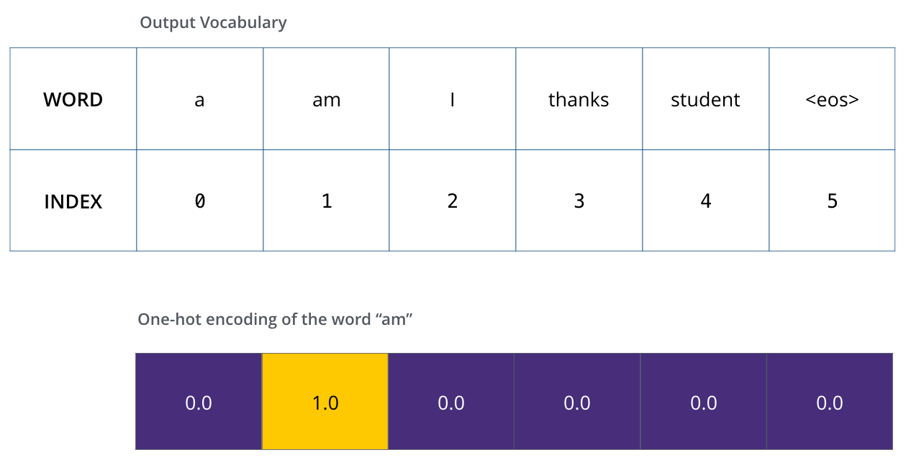
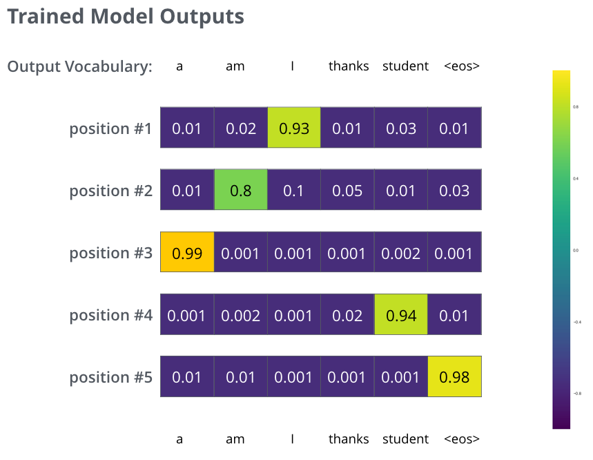

# transfromer的定义

transfromer的网络结构由self-Attenion和Feed Forward Neural Network组成，完全由Attention机制组成；

它抛弃了传统的CNN和RNN

一个基于Transformer的可训练的神经网络可以通过堆叠Transformer的形式进行搭建

采用Attention机制的原因是考虑到RNN（或者LSTM，GRU等）的计算限制为是顺序的，也就是说RNN相关算法只能从左向右依次计算或者从右向左依次计算，这种机制带来了两个问题：

1. 时间片 t的计算依赖t-1 时刻的计算结果，这样限制了模型的并行能力；
2. 顺序计算的过程中信息会丢失，尽管LSTM等门机制的结构一定程度上缓解了长期依赖的问题，但是对于特别长期的依赖现象,LSTM依旧无能为力。

Transformer的提出解决了上面两个问题，首先它使用了Attention机制，将序列中的任意两个位置之间的距离是缩小为一个常量；其次它不是类似RNN的顺序结构，因此具有更好的并行性，符合现有的GPU框架。

论文中给出Transformer的定义是：Transformer is the first transduction model relying entirely on self-attention to compute representations of its input and output without using sequence aligned RNNs or convolution。

# **A High-Level Look**

我们先将整个模型视为黑盒，比如在机器翻译中，接收一种语言的句子作为输入，然后将其翻译成其他语言输出。

细看下，其中由编码组件、解码组件和它们之间的连接层组成。

编码组件是六层编码器首位相连堆砌而成，解码组件也是六层解码器堆成的。

编码器是完全结构相同的，但是并不共享参数，每一个编码器都可以拆解成以下两个字部分。

编码器的输入首先流过一个self-attention层，该层帮助编码器能够看到输入序列中的其他单词当它编码某个词时。后面，我们会细看self-attention的内部结构。
self-attention的输出流向一个前向网络，每个输入位置对应的前向网络是独立互不干扰的。
解码器同样也有这些子层，但是在两个子层间增加了attention层，该层有助于解码器能够关注到输入句子的相关部分，与 [seq2seq model](https://jalammar.github.io/visualizing-neural-machine-translation-mechanics-of-seq2seq-models-with-attention/)的Attention作用相似。

# Attention

Attention model和seq2seq模型紧密联系的

Attention解决了基于encoder-decoder结构下seq2seq模型的信息瓶颈问题。

Attention的核心思想是在decoder的每个时间步，选择与encoder直接连接的方式，专注于source序列相应的部分。

在seq2seq模型应用attention如下图所示：

1、在decoder里面每个单元的输出前，计算该单元hidden status与encoder各个单元的hidden status计算点积，获得attention分数

2、然后softmax归一化处理获得attention分布

3、attention分布作为权重对encoder中各个单元hidden status求加权和

4、把decoder该单元的attention输出与hidden status，计算输出

优点是：

-  Attention significantly improves NMT performance

It’s very useful to allow decoder to focus on certain parts of the source

-  Attention solves the bottleneck problem

Attention allows decoder to look directly at source; bypass bottleneck

- Attention helps with vanishing gradient problem 
- Attention provides some interpretability 

但是缺点是：

1、Attention不能并行化；

2、Attention忽略了输入句子、目标句子之间的关系；

# **Self-Attention**

## **Self-Attention at a High Level**

作为我们想要翻译的输入语句“The animal didn’t cross the street because it was too tired”。句子中"it"指的是什么呢？“it"指的是"street” 还是“animal”？对人来说很简单的问题，但是对算法而言并不简单。
当模型处理单词“it”时，self-attention允许将“it”和“animal”联系起来。当模型处理每个位置的词时，self-attention允许模型看到句子的其他位置信息作辅助线索来更好地编码当前词。如果你对RNN熟悉，就能想到RNN的隐状态是如何允许之前的词向量来解释合成当前词的解释向量。Transformer使用self-attention来将相关词的理解编码到当前词中。

## **Self-Attention in Detail**

我们先看下如何计算self-attention的向量，再看下如何以矩阵方式计算。
**第一步**，根据编码器的输入向量，生成三个向量，比如，对每个词向量，生成query-vec, key-vec, value-vec，生成方法为分别乘以三个矩阵，这些矩阵在训练过程中需要学习。【注意：不是每个词向量独享3个matrix，而是所有输入共享3个转换矩阵；**权重矩阵是基于输入位置的转换矩阵**；有个可以尝试的点，如果每个词独享一个转换矩阵，会不会效果更厉害呢？】
注意到这些新向量的维度比输入词向量的维度要小（512–>64），并不是必须要小的，是为了让多头attention的计算更稳定。

输入乘以W^q得到query

所谓的query/key/value-vec是什么？
这种提取对计算和思考attention是有益的，当读完下面attention是如何计算的之后，你将对这些向量的角色有更清晰的了解。
**第二步**，计算attention就是计算一个分值。对“Thinking Matchines”这句话，对“Thinking”（pos#1）计算attention 分值。我们需要计算每个词与“Thinking”的评估分，这个分决定着编码“Thinking”时（某个固定位置时），每个输入词需要集中多少关注度。
这个分，通过“Thing”对应query-vector与所有词的key-vec依次做点积得到。所以当我们处理位置#1时，第一个分值是q1和k1的点积，第二个分值是q1和k2的点积。

**第三步和第四步**，除以8（=dimkey‾‾‾‾‾‾√=\sqrt{dim_{key}}=*d**i**m**k**e**y*），这样梯度会更稳定。然后加上softmax操作，归一化分值使得全为正数且加和为1。

softmax分值决定着在这个位置，每个词的表达程度（关注度）。很明显，这个位置的词应该有最高的归一化分数，但大部分时候总是有助于关注该词的相关的词。
**第五步**，将softmax分值与value-vec按位相乘。保留关注词的value值，削弱非相关词的value值。
**第六步**，将所有加权向量加和，产生该位置的self-attention的输出结果。

上述就是self-attention的计算过程，生成的向量流入前向网络。在实际应用中，上述计算是以速度更快的矩阵形式进行的。下面我们看下在单词级别的矩阵计算。

#### **Matrix Calculation of Self-Attention**

**第一步**，计算query/key/value matrix，将所有输入词向量合并成输入矩阵XX*X*，并且将其分别乘以权重矩阵Wq,Wk,WvW^q, W^k, W^v*W**q*,*W**k*,*W**v*。

输入矩阵X的每一行表示输入句子的一个词向量

**最后**，鉴于我们使用矩阵处理，将步骤2~6合并成一个计算self-attention层输出的公式。

矩阵形式的self-attention计算

## multi-headed机制的self-attention

论文进一步增加了multi-headed的机制到self-attention上，在如下两个方面提高了attention层的效果：

1. 多头机制扩展了模型集中于不同位置的能力。在上面的例子中，z1只包含了其他词的很少信息，仅由实际自己词决定。在其他情况下，比如翻译 “The animal didn’t cross the street because it was too tired”时，我们想知道单词"it"指的是什么。
2. 多头机制赋予attention多种子表达方式。像下面的例子所示，在多头下有多组query/key/value-matrix，而非仅仅一组（论文中使用8-heads）。每一组都是随机初始化，经过训练之后，输入向量可以被映射到不同的子表达空间中。

每个head都有一组Q/K/V matrix

如果我们计算multi-headed self-attention的，分别有八组不同的Q/K/V matrix，我们得到八个不同的矩阵。

这会带来点麻烦，前向网络并不能接收八个矩阵，而是希望输入是一个矩阵，所以要有种方式处理下八个矩阵合并成一个矩阵。

上述就是多头自注意机制的内容，我认为还仅是一部分矩阵，下面尝试着将它们放到一个图上可视化如下。

现在加入attention heads之后，重新看下当编码“it”时，哪些attention head会被集中。

编码"it"时，一个attention head集中于"the animal"，另一个head集中于“tired”，某种意义上讲，模型对“it”的表达合成了的“animal”和“tired”两者

如果我们将所有的attention heads都放入到图中，就很难直观地解释了。

# 位置编码(TODO)

截止到目前为止，我们还没有讨论如何理解输入语句中词的顺序。
为解决词序的利用问题，Transformer新增了一个向量对每个词，这些向量遵循模型学习的指定模式，来决定词的位置，或者序列中不同词的举例。对其理解，增加这些值来提供词向量间的距离，当其映射到Q/K/V向量以及点乘的attention时。

为了能够给模型提供词序的信息，新增位置emb向量，每个向量值都遵循指定模式

如果假设位置向量有4维，实际的位置向量将如下所示：

一个只有4维的位置向量表示例子

# **The Residuals**

编码器结构中值得提出注意的一个细节是，在每个子层中（slef-attention, ffnn），都有残差连接，并且紧跟着[layer-normalization](https://arxiv.org/abs/1607.06450)。

如果我们可视化向量和layer-norm操作，将如下所示：

在解码器中也是如此，假设两层编码器+两层解码器组成Transformer，其结构如下：

# **The Decoder Side（TODO）**

TODO:DECODER在时间步上更具体的行为

现在我们已经了解了编码器侧的大部分概念，也基本了解了解码器的工作方式，下面看下他们是如何共同工作的。
编码器从输入序列的处理开始，最后的编码器的输出被转换为K和V，它俩被每个解码器的"encoder-decoder atttention"层来使用，帮助解码器集中于输入序列的合适位置。

在编码之后，是解码过程；解码的每一步输出一个元素作输出序列

下面的步骤一直重复直到一个特殊符号出现表示解码器完成了翻译输出。每一步的输出被喂到下一个解码器中。正如编码器的输入所做的处理，对解码器的输入增加位置向量。

在解码器中的self attention 层与编码器中的稍有不同，在解码器中，self-attention 层仅仅允许关注早于当前输出的位置。在softmax之前，通过遮挡未来位置（将它们设置为-inf）来实现。
"Encoder-Decoder Attention "层工作方式跟multi-headed self-attention是一样的，除了一点，它从前层获取输出转成query矩阵，接收最后层编码器的key和value矩阵做key和value矩阵。

# **The Final Linear and Softmax Layer**

解码器最后输出浮点向量，如何将它转成词？这是最后的线性层和softmax层的主要工作。
线性层是个简单的全连接层，将解码器的最后输出映射到一个非常大的logits向量上。假设模型已知有1万个单词（输出的词表）从训练集中学习得到。那么，logits向量就有1万维，每个值表示是某个词的可能倾向值。
softmax层将这些分数转换成概率值（都是正值，且加和为1），最高值对应的维上的词就是这一步的输出单词。

# **Recap of Training**

现在我们已经了解了一个训练完毕的Transformer的前向过程，顺道看下训练的概念也是非常有用的。
在训练时，模型将经历上述的前向过程，当我们在标记训练集上训练时，可以对比预测输出与实际输出。
为了可视化，假设输出一共只有6个单词（“a”, “am”, “i”, “thanks”, “student”, “”）

模型的词表是在训练之前的预处理中生成的

一旦定义了词表，我们就能够构造一个同维度的向量来表示每个单词，比如one-hot编码，下面举例编码“am”。

举例采用one-hot编码输出词表

下面让我们讨论下模型的loss损失，在训练过程中用来优化的指标，指导学习得到一个非常准确的模型。

# **The Loss Function**

我们用一个简单的例子来示范训练，比如翻译“merci”为“thanks”。那意味着输出的概率分布指向单词“thanks”，但是由于模型未训练是随机初始化的，不太可能就是期望的输出。

由于模型参数是随机初始化的，未训练的模型输出随机值。我们可以对比真实输出，然后利用误差后传调整模型权重，使得输出更接近与真实输出

如何对比两个概率分布呢？简单采用 [cross-entropy](https://colah.github.io/posts/2015-09-Visual-Information/)或者[Kullback-Leibler divergence](https://www.countbayesie.com/blog/2017/5/9/kullback-leibler-divergence-explained)中的一种。
鉴于这是个极其简单的例子，更真实的情况是，使用一个句子作为输入。比如，输入是“je suis étudiant”，期望输出是“i am a student”。在这个例子下，我们期望模型输出连续的概率分布满足如下条件：
1 每个概率分布都与词表同维度。
2 第一个概率分布对“i”具有最高的预测概率值。
3 第二个概率分布对“am”具有最高的预测概率值。
4 一直到第五个输出指向""标记。

对一个句子而言，训练模型的目标概率分布

在足够大的训练集上训练足够时间之后，我们期望产生的概率分布如下所示：

训练好之后，模型的输出是我们期望的翻译。当然，这并不意味着这一过程是来自训练集。注意，每个位置都能有值，即便与输出近乎无关，这也是softmax对训练有帮助的地方。

现在，因为模型每步只产生一组输出，假设模型选择最高概率，扔掉其他的部分，这是种产生预测结果的方法，叫做greedy 解码。另外一种方法是beam search，每一步仅保留最头部高概率的两个输出，根据这俩输出再预测下一步，再保留头部高概率的两个输出，重复直到预测结束。top_beams是超参可试验调整。

# **Go Forth And Transform**

希望本文能够帮助读者对Transformer的主要概念理解有个破冰效果，如果想更深入了解，建议如下步骤：
1 阅读 [Attention Is All You Need](https://arxiv.org/abs/1706.03762)paper，Transformer的博客文章[Transformer: A Novel Neural Network Architecture for Language Understanding](https://ai.googleblog.com/2017/08/transformer-novel-neural-network.html)，[Tensor2Tensor](https://ai.googleblog.com/2017/06/accelerating-deep-learning-research.html)使用说明。
2 观看"[Łukasz Kaiser’s talk](https://www.youtube.com/watch?v=rBCqOTEfxvg)"，梳理整个模型及其细节。
3 耍一下项目[Jupyter Notebook provided as part of the Tensor2Tensor repo](https://colab.research.google.com/github/tensorflow/tensor2tensor/blob/master/tensor2tensor/notebooks/hello_t2t.ipynb)
4 尝试下项目[Tensor2Tensor](https://github.com/tensorflow/tensor2tensor)

# 参考

The Illustrated Transformer

<http://jalammar.github.io/illustrated-transformer/>

The Illustrated Transformer【译】

<https://blog.csdn.net/yujianmin1990/article/details/85221271>

The Illustrated BERT, ELMo, and co. (How NLP Cracked Transfer Learning)

<http://jalammar.github.io/illustrated-bert/>

图解BERT
<https://blog.csdn.net/qq_41664845/article/details/84787969>

迁移学习NLP：BERT、ELMo等直观图解【译】

<https://zhuanlan.zhihu.com/p/52282552>

The Annotated Transformer

<http://nlp.seas.harvard.edu/2018/04/03/attention.html>

