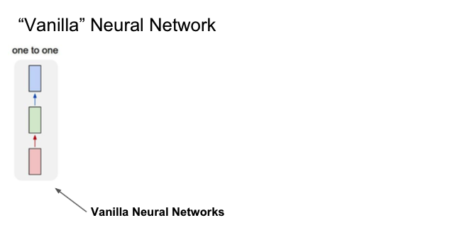
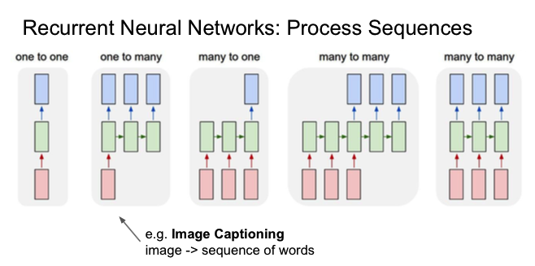
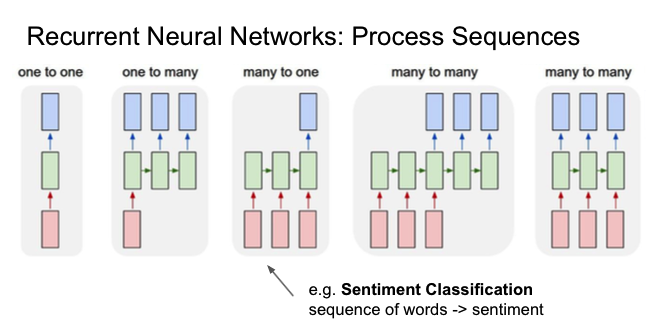
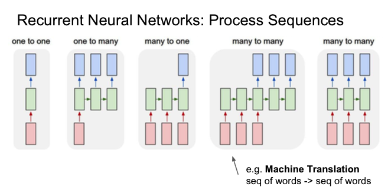
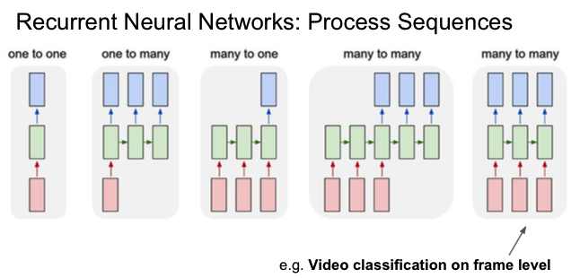
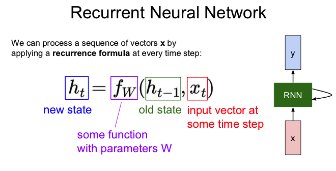
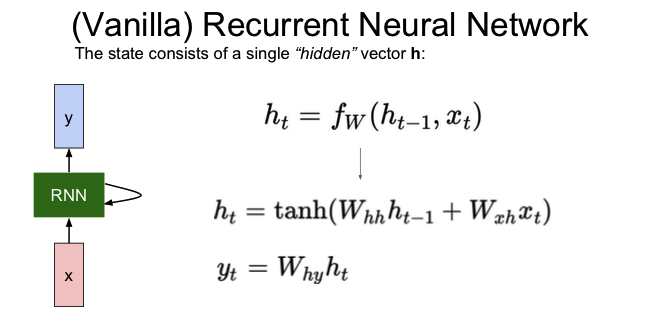
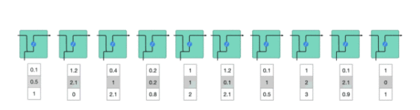

# 一、RNN

## RNN根据任务类型去划分有

### one to one(Vanilla RNN)

### one to many

### many to one

### many to many

## vanilla rnn 计算公式

## Vanilla RNN Gradient Flow

# 二、Long Short Term Memory (LSTM)

超生动图解LSTM和GRU：拯救循环神经网络的记忆障碍，就靠它们了

https://zhuanlan.zhihu.com/p/46981722

# 三、GRU

参考

1、cs231n_2017_lecture10 Recurrent Neural Networks

2、超生动图解LSTM和GRU：拯救循环神经网络的记忆障碍，就靠它们了

https://zhuanlan.zhihu.com/p/46981722

