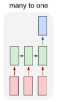
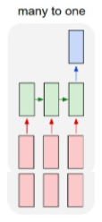

### Q1-keras LSTM api 文档中units参数怎么理解？

<https://keras.io/layers/recurrent/#lstm>

```
keras.layers.LSTM(units, activation='tanh', recurrent_activation='hard_sigmoid', use_bias=True, kernel_initializer='glorot_uniform', recurrent_initializer='orthogonal', bias_initializer='zeros', unit_forget_bias=True, kernel_regularizer=None, recurrent_regularizer=None, bias_regularizer=None, activity_regularizer=None, kernel_constraint=None, recurrent_constraint=None, bias_constraint=None, dropout=0.0, recurrent_dropout=0.0, implementation=1, return_sequences=False, return_state=False, go_backwards=False, stateful=False, unroll=False)
```


样例代码

<https://www.tensorflow.org/alpha/tutorials/text/text_generation?hl=zh-cn>

```python
def build_model(vocab_size, embedding_dim, rnn_units, batch_size):
  model = tf.keras.Sequential([
    tf.keras.layers.Embedding(vocab_size, embedding_dim,
                              batch_input_shape=[batch_size, None]),
    tf.keras.layers.LSTM(rnn_units,
                        return_sequences=True,
                        stateful=True,
                        recurrent_initializer='glorot_uniform'),
    tf.keras.layers.Dense(vocab_size)
  ])
  return model
```


=====


可以看到中间的 cell 里面有四个黄色小框，你如果理解了那个代表的含义一切就明白了，每一个小黄框代表一个**前馈网络层**，对，就是经典的神经网络的结构，**num_units就是这个层的隐藏神经元个数**，就这么简单。其中1、2、4的激活函数是 sigmoid，第三个的激活函数是 tanh。


另外几个需要注意的地方：

1、 cell 的状态是一个向量，是有**多个值**的。。。一开始没有理解这点的时候怎么都想不明白

2、 上一次的状态 h(t-1)是怎么和下一次的输入 x(t) 结合（concat）起来的，这也是很多资料没有明白讲的地方，也很简单，concat， 直白的说就是把**二者直接拼起来**，比如 x是28位的向量，h(t-1)是128位的，那么拼起来就是156位的向量，就是这么简单。。

3、 cell 的**权重是共享**的，这是什么意思呢？这是指这张图片上有三个绿色的大框，代表三个 cell 对吧，但是实际上，它只是代表了**一个 cell 在不同时序时候的状态**，所有的数据只会通过一个 cell，然后不断更新它的权重。

4、那么一层的 LSTM 的参数有多少个？根据第 3 点的说明，我们知道参数的数量是由 cell 的数量决定的，这里只有一个 cell，所以**参数的数量就是这个 cell 里面用到的参数个数**。假设 num_units 是128，输入是28位的，那么根据上面的第 2 点，可以得到，四个小黄框的参数一共有 （128+28）*（128 * 4），也就是156 * 512，可以看看 TensorFlow 的最简单的 LSTM 的案例，中间层的参数就是这样，不过还要加上输出的时候的激活函数的参数，假设是10个类的话，就是128*10的 W 参数和10个bias 参数

5、cell 最上面的一条线的状态即 s(t) 代表了**长时记忆**，而下面的 h(t)则代表了**工作记忆或短时记忆**


### Q2- LSTM 做时间序列预测的模型结构 - Keras 实现

根据问题的输入输出模式划分，来看一下几种时间序列问题所对应的 LSTM 模型结构如何实现。

#### 1. Univariate



Univariate 是指：

input 为多个时间步， output 为一个时间的问题。

**数例：**

```text
训练集：
X,          y
10, 20, 30      40
20, 30, 40      50
30, 40, 50      60
…


预测输入：
X，
70, 80, 90
```

**模型的 Keras 代码：**

```text
# define model【Vanilla LSTM】

model = Sequential()
model.add( LSTM(50,  activation='relu',  input_shape = (n_steps, n_features)) )
model.add( Dense(1) )
model.compile(optimizer='adam', loss='mse')

n_steps = 3
n_features = 1
```

其中：

`n_steps` 为输入的 X 每次考虑几个**时间步** `n_features` 为每个时间步的**序列数**

**这个是最基本的模型结构**，我们后面几种模型会和这个进行比较。


#### 2. Multiple Input



Multiple Input 是指：

input 为多个序列， output 为一个序列的问题。

**数例：**

```text
训练集：
X，       y
[[10 15]
 [20 25]
 [30 35]] 65
[[20 25]
 [30 35]
 [40 45]] 85
[[30 35]
 [40 45]
 [50 55]] 105
[[40 45]
 [50 55]
 [60 65]] 125
…


预测输入：
X，
80,  85
90,  95
100,     105
```

即数据样式为：

```text
in_seq1： [10, 20, 30, 40, 50, 60, 70, 80, 90]
in_seq2： [15, 25, 35, 45, 55, 65, 75, 85, 95]

out_seq： [in_seq1[i]+in_seq2[i] for i in range(len(in_seq1))]
```

**模型的 Keras 代码：**

```text
# define model【Vanilla LSTM】
model = Sequential()
model.add(LSTM(50, activation='relu', input_shape=(n_steps, n_features)))
model.add(Dense(1))
model.compile(optimizer='adam', loss='mse')

n_steps = 3
# 此例中 n features = 2，因为输入有两个并行序列
n_features = X.shape[2]
```

其中：

`n_steps` 为输入的 X 每次考虑几个时间步 `n_features` 此例中 = 2，因为输入有**两个并行序列**

**和 Univariate 相比：**

模型的结构代码是一样的，只是在 `n_features = X.shape[2]`，而不是 1.


#### 3. Multi-Step


Multi-Step 是指：

input 为多个时间步， output 也是**多个时间步**的问题。

**数例：**

```text
训练集：
X,          y
[10 20 30] [40 50]
[20 30 40] [50 60]
[30 40 50] [60 70]
[40 50 60] [70 80]
…


预测输入：
X，
[70, 80, 90]
```

**模型的 Keras 代码：**

```text
# define model【Vanilla LSTM】
model = Sequential()
model.add(LSTM(100, activation='relu', return_sequences=True, input_shape=(n_steps_in, n_features)))
model.add(LSTM(100, activation='relu'))
model.add(Dense(n_steps_out))
model.compile(optimizer='adam', loss='mse')

n_steps_in, n_steps_out = 3, 2
n_features = 1
```

其中：

`n_steps_in` 为输入的 X 每次考虑几个时间步 `n_steps_out` 为输出的 y 每次考虑几个时间步 `n_features` 为输入有几个序列

**和 Univariate 相比：**

模型结构的定义中，多了一个 `return_sequences=True`，即返回的是序列， 而且 `input_shape=(n_steps_in, n_features)` 中有代表输入时间步数的 `n_steps_in`， 输出为 `Dense(n_steps_out)`，代表输出的 y 每次考虑几个时间步.

**当然这个问题还可以用 Encoder-Decoder 结构实现：**

```python
# define model【Encoder-Decoder Model】
model = Sequential()
model.add(LSTM(100, activation='relu', input_shape=(n_steps_in, n_features)))
model.add(RepeatVector(n_steps_out))
model.add(LSTM(100, activation='relu', return_sequences=True))
model.add(TimeDistributed(Dense(1)))
model.compile(optimizer='adam', loss='mse')
```