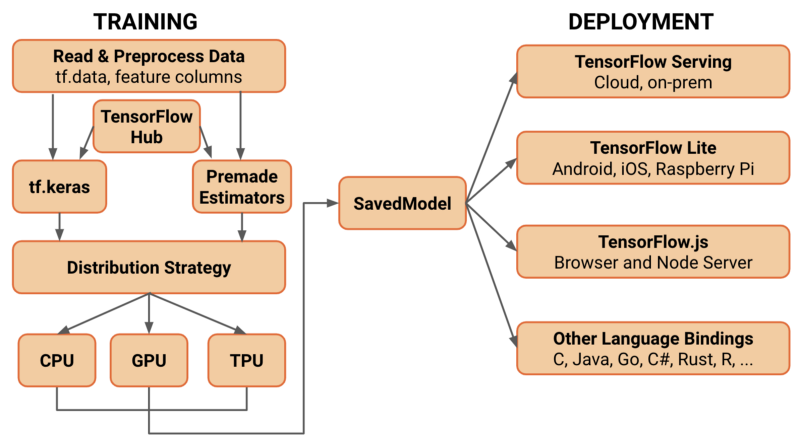

[TOC]

# TensorFlow2.0

​		Keras 是一个用户友好的机器学习 API 标准，并将成为用于构建和训练模型最重要的高级 API。Keras API 让你可以轻松开始使用 TensorFlow。重要的是，Keras 提供了一些模型创建 API（顺序、功能和子类），让用户可以为项目选择合适的抽象级别。TensorFlow 的实现增强包括 eager execution、快速迭代和直接调试，以及用于构建可扩展输入管道的 tf.data。



​		

以下为示例工作流程：

1. 使用 tf.data 加载数据；使用由 tf.data 创建的输入管道读取训练数据；使用 tf.feature_column 描述特征特点，例如分段和特征交叉；支持来自内存数据的便捷输入（例如，NumPy）。
2. 使用 tf.keras 或预先做好的评估器构建、训练和验证你的模型。 Keras 与 TensorFlow 的其余部分紧密集成，因此可以随时访问 TensorFlow 的功能。还可以直接使用一组标准的打包模型（例如，线性或逻辑回归、梯度提升树、随机森林，用 tf.estimator API 实现）。如果你不想从头开始训练模型，不久之后你就可以用迁移学习来训练使用 TensorFlow Hub 模块的 Keras 或评估器模型。
3. 运行 eager execution 和调试，然后使用 tf.function（图形）。默认情况下，TensorFlow 2.0 以 eager execution 的方式运行，以便于使用和调试。此外，tf.function 注释将你的 Python 程序完全透明地转换为 TensorFlow 图形。此过程保留了 1.x TensorFlow 基于图形运行的所有优点：在性能优化、远程运行和轻松序列化、导出和部署的同时，使用简单的 Python 让程序表达更加灵活易用。
4. 使用分布策略进行分布式训练。对于大型机器学习训练任务，分布式策略 API 可以轻松地在不同硬件配置上分发和训练模型，而无需更改模型定义。由于 TensorFlow 支持各种硬件加速器，如 CPU、GPU 和 TPU，因此你可以将训练工作负载分配到单节点 / 多加速器以及多节点 / 多加速器配置（包括 TPU Pod）。此 API 支持各种群集配置，还提供在本地或云环境中部署 Kubernetes 群集训练的模板。
5. 导出到 SavedModel。 TensorFlow 将 SavedModel 标准化并作为 TensorFlow Serving、TensorFlow Lite、TensorFlow.js、TensorFlow Hub 等的交换格式。


# #1 Keras

https://www.tensorflow.org/guide/keras?hl=zh-cn

## 1.1 导入 tf.keras

## 1.2 构建简单的模型

### 序列模型

### 配置层


## 1.3 训练和评估

### 设置训练流程

### 输入 tf.data 数据集

### 评估和预测


## 1.4 构建高级模型

### 函数式 API

### 模型子类化

通过对 [`tf.keras.Model`](https://www.tensorflow.org/api_docs/python/tf/keras/models/Model?hl=zh-cn) 进行子类化并定义您自己的前向传播来构建完全可自定义的模型。在 `__init__` 方法中创建层并将它们设置为类实例的属性。在 `call` 方法中定义前向传播。

在启用 [Eager Execution](https://www.tensorflow.org/guide/eager?hl=zh-cn) 时，模型子类化特别有用，因为可以命令式地编写前向传播。

以下示例展示了使用自定义前向传播进行子类化的 [`tf.keras.Model`](https://www.tensorflow.org/api_docs/python/tf/keras/models/Model?hl=zh-cn)：

```python
class MyModel(tf.keras.Model):

  def __init__(self, num_classes=10):
    super(MyModel, self).__init__(name='my_model')
    self.num_classes = num_classes
    # Define your layers here.
    self.dense_1 = layers.Dense(32, activation='relu')
    self.dense_2 = layers.Dense(num_classes, activation='sigmoid')

  def call(self, inputs):
    # Define your forward pass here,
    # using layers you previously defined (in `__init__`).
    x = self.dense_1(inputs)
    return self.dense_2(x)

  def compute_output_shape(self, input_shape):
    # You need to override this function if you want to use the subclassed model
    # as part of a functional-style model.
    # Otherwise, this method is optional.
    shape = tf.TensorShape(input_shape).as_list()
    shape[-1] = self.num_classes
    return tf.TensorShape(shape)
```


### 自定义层


## 1.5 回调

## 1.6 保存和恢复


# #2 Eager Execution

## Eager训练

以下示例将创建一个多层模型，该模型会对标准 MNIST 手写数字进行分类。它演示了在 Eager Execution 环境中构建可训练图的优化器和层 API。

### mnist data | model | optimizer | loss

```python
# Fetch and format the mnist data
(mnist_images, mnist_labels), _ = tf.keras.datasets.mnist.load_data()

dataset = tf.data.Dataset.from_tensor_slices(
  (tf.cast(mnist_images[...,tf.newaxis]/255, tf.float32),
   tf.cast(mnist_labels,tf.int64)))
dataset = dataset.shuffle(1000).batch(32)

# Build the model
mnist_model = tf.keras.Sequential([
  tf.keras.layers.Conv2D(16,[3,3], activation='relu',
                         input_shape=(None, None, 1)),
  tf.keras.layers.Conv2D(16,[3,3], activation='relu'),
  tf.keras.layers.GlobalAveragePooling2D(),
  tf.keras.layers.Dense(10)
])

# optimizer
optimizer = tf.keras.optimizers.Adam()

# loss
loss_object = tf.keras.losses.SparseCategoricalCrossentropy(from_logits=True)
loss_history = []


```

### train_step定义

```python
def train_step(images, labels):
  with tf.GradientTape() as tape:
    logits = mnist_model(images, training=True)
    
    # Add asserts to check the shape of the output.
    tf.debugging.assert_equal(logits.shape, (32, 10))
    
    loss_value = loss_object(labels, logits)

  loss_history.append(loss_value.numpy().mean())
  grads = tape.gradient(loss_value, mnist_model.trainable_variables)
  optimizer.apply_gradients(zip(grads, mnist_model.trainable_variables))
```

### 训练

```python
def train():
  for epoch in range(3):
    for (batch, (images, labels)) in enumerate(dataset):
      train_step(images, labels)
    print ('Epoch {} finished'.format(epoch))
```

```
Epoch 0 finished
Epoch 1 finished
Epoch 2 finished
```


## 自动微分高级内容

pass

https://www.tensorflow.org/beta/guide/eager?hl=zh-cn#advanced_automatic_differentiation_topics


# #3 tf.data: 输入流API

## 读取输入数据（多种来源）

## Batching dataset elements


# #4 tf.feature_column

## 演示几种特征列

```python
feature_columns = []

# 数值列
for header in ['age', 'trestbps', 'chol', 'thalach', 'oldpeak', 'slope', 'ca']:
  feature_columns.append(feature_column.numeric_column(header))

# 分桶列
age_buckets = feature_column.bucketized_column(age, boundaries=[18, 25, 30, 35, 40, 45, 50, 55, 60, 65])
feature_columns.append(age_buckets)

# 分类列
thal = feature_column.categorical_column_with_vocabulary_list(
      'thal', ['fixed', 'normal', 'reversible'])
thal_one_hot = feature_column.indicator_column(thal)
feature_columns.append(thal_one_hot)

# 嵌入列
thal_embedding = feature_column.embedding_column(thal, dimension=8)
feature_columns.append(thal_embedding)

# 组合列
crossed_feature = feature_column.crossed_column([age_buckets, thal], hash_bucket_size=1000)
crossed_feature = feature_column.indicator_column(crossed_feature)
feature_columns.append(crossed_feature)
```


```python
# 建立一个新的特征层
# 使用密集特征（DenseFeatures）层将特征列输入到我们的 Keras 模型中。
feature_layer = tf.keras.layers.DenseFeatures(feature_columns)

# 创建，编译和训练模型
model = tf.keras.Sequential([
  feature_layer,
  layers.Dense(128, activation='relu'),
  layers.Dense(128, activation='relu'),
  layers.Dense(1, activation='sigmoid')
])

model.compile(optimizer='adam',
              loss='binary_crossentropy',
              metrics=['accuracy'],
              run_eagerly=True)

model.fit(train_ds,
          validation_data=val_ds,
          epochs=5)
```


## keras's layers.Input

```python
import tensorflow as tf

inputs = tf.keras.Input(shape=(3,))
x = tf.keras.layers.Dense(4, activation=tf.nn.relu)(inputs)
outputs = tf.keras.layers.Dense(5, activation=tf.nn.softmax)(x)
model = tf.keras.Model(inputs=inputs, outputs=outputs)
```

