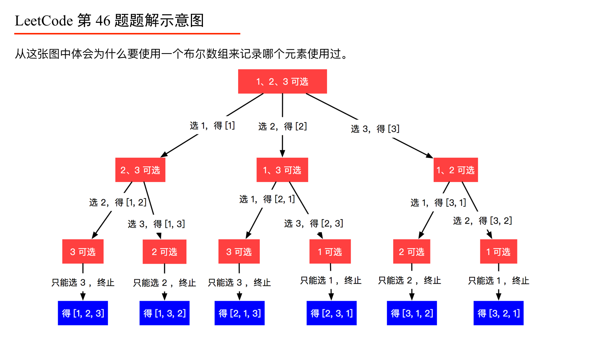
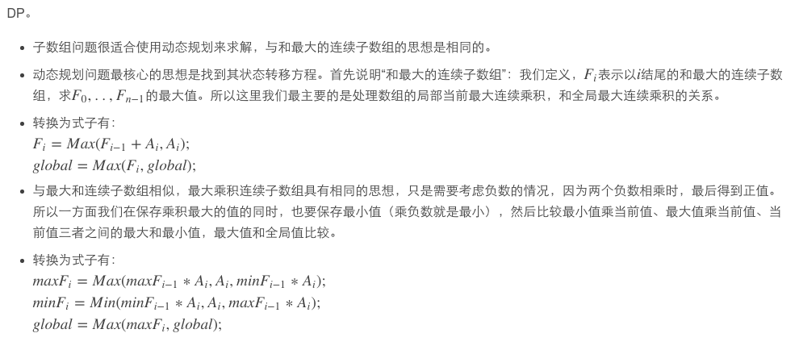

# 数组的排列和组合【L2】

## 全排列

题目描述：

给定一个没有重复数字的序列，返回其所有可能的全排列。

示例:

输入: [1,2,3]
输出:
[
  [1,2,3],
  [1,3,2],
  [2,1,3],
  [2,3,1],
  [3,1,2],
  [3,2,1]
]


**思路分析1**

全排列首先考虑深度优先搜索，每个深度的遍历都从 0到nums.length - 1
每次循环开始需要判断当前值是否已经使用过，即 if (!tempList.contains(nums[i]))

创建一个List<Integer> tempList存放临时数据
当tempList.size() == nums.length时，res.add(new ArrayList<Integer>(tempList))将tempList存入结果
此处不能直接add.(tempList)，否则改变tempList也会导致结果的改变

特别注意每次递归结束前都需要将刚加入的值从tempList中去掉


**思路分析2**

求解关键：画图理解题意并且打印出一些信息观察程序的执行流程。




```python
import copy

class Solution(object):
    result = []
    tmp_list = []
    
    def permute(self, nums):
        """
        :type nums: List[int]
        :rtype: List[List[int]]
        """
        self.dfs(nums)
        return self.result
    
    def dfs(self, nums):
        if len(self.tmp_list)==len(nums):
            self.result.append(copy.copy(self.tmp_list))
            return 
        
        for i in range(0, len(nums)):
            if nums[i] not in self.tmp_list:
                self.tmp_list.append(nums[i])
                self.dfs(nums)
                self.tmp_list = self.tmp_list[:len(self.tmp_list)-1]


if __name__ == "__main__":
    # nums = [1,2,3]
    nums = [1]
    print(Solution().permute(nums))
    # [[1, 2, 3], [1, 3, 2], [2, 1, 3], [2, 3, 1], [3, 1, 2], [3, 2, 1]]

```


```python
class Solution(object):
    def permute(self, nums):
        """
        :type nums: List[int]
        :rtype: List[List[int]]
        """
        if len(nums)==0:
            return list()

        ret,temp = list(),list()
        isvisted = [False]*len(nums)
        self.backtracing(ret,temp,nums,isvisted)
        return ret

    def backtracing(self, ret, temp, nums, isvisted):
        if len(temp) == len(nums):
            ret.append(temp[:])
            return

        for i in xrange(0, len(nums)):
            if not isvisted[i]:
                isvisted[i] = True
                temp.append(nums[i])
                self.backtracing(ret,temp,nums,isvisted)
                temp.pop()
                isvisted[i] = False
```


## 子集

LeetCode 78. Subsets

题目描述
给定一组不同的整数 nums，返回所有可能的子集（幂集）。

注意事项：该解决方案集不能包含重复的子集。

例如，如果 nums = [1,2,3]，结果为以下答案：

[
  [3],
  [1],
  [2],
  [1,2,3],
  [1,3],
  [2,3],
  [1,2],
  []


### **思路分析1**

分析
子集与全排列有两大区别

输出的List长度不等
所谓子集，就是要求该集合所包含的所有集合
所以每次循环都要将tepmList加入res
而不是等tempList.size() == nums.length
List中元素不能重复
在全排列中，结果中每个List包含的元素都相同，只是顺序不一样
如[1,2,3]和[3,2,1]
子集则不同，每个List中的元素都不相同，所以循环不能再从0开始
需要重新定义一个变量start作为dfs()的输入参数
每次递归将start设为i + 1 即不会遍历之前访问过的元素

```python
import copy

class Solution(object):
    result = []
    tmp_list = []

    def subsets(self, nums):
        """
        :type nums: List[int]
        :rtype: List[List[int]]
        """
        self.result.append([])
        nums = sorted(nums)
        self.dfs(nums, 0)
        return self.result
    
    def dfs(self, nums, start):
        if len(self.tmp_list) == len(nums):
            return 

        # 子集则不同，每个List中的元素都不相同，所以循环不能再从0开始
        # 需要重新定义一个变量start作为dfs()的输入参数
        # 每次递归将start设为i + 1 即不会遍历之前访问过的元素
        for  i in range(start, len(nums)):
            # if nums[i] not in self.tmp_list:
            self.tmp_list.append(nums[i])
            self.result.append( copy.copy(self.tmp_list) )
            self.dfs(nums, i+1)
            self.tmp_list.pop()

if __name__ == "__main__":
    nums = [1,2,3]
    print(Solution().subsets(nums))
    # [[], [1], [1, 2], [1, 2, 3], [1, 3], [2], [2, 3], [3]]
```


### **思路分析2（更好理解！）**

更好理解！！！

下面来看递归的解法，相当于一种深度优先搜索，参见网友 [JustDoIt的博客](http://www.cnblogs.com/TenosDoIt/p/3451902.html)，由于原集合每一个数字只有两种状态，要么存在，要么不存在，那么在构造子集时就有选择和不选择两种情况，所以可以构造一棵二叉树，左子树表示选择该层处理的节点，右子树表示不选择，最终的叶节点就是所有子集合，树的结构如下：

```
                        []        
                   /          \        
                  /            \     
                 /              \
              [1]                []
           /       \           /    \
          /         \         /      \        
       [1 2]       [1]       [2]     []
      /     \     /   \     /   \    / \
  [1 2 3] [1 2] [1 3] [1] [2 3] [2] [3] []    
```


```c++
class Solution {
public:
    vector<vector<int> > subsets(vector<int> &S) {
        vector<vector<int> > res;
        vector<int> out;
        sort(S.begin(), S.end());
        getSubsets(S, 0, out, res);
        return res;
    }
    void getSubsets(vector<int> &S, int pos, vector<int> &out, vector<vector<int> > &res) {
        res.push_back(out);
        for (int i = pos; i < S.size(); ++i) {
            out.push_back(S[i]);
            getSubsets(S, i + 1, out, res);
            out.pop_back();
        }
    }
};
```


# 连续子数组的最大和

- 题目描述：

给定一个整数数组 `nums` ，找到一个具有最大和的连续子数组（子数组最少包含一个元素），返回其最大和。

**示例:**

```
输入: [-2,1,-3,4,-1,2,1,-5,4],
输出: 6
解释: 连续子数组 [4,-1,2,1] 的和最大，为 6。
```

**进阶:**

如果你已经实现复杂度为 O(*n*) 的解法，尝试使用更为精妙的分治法求解。


**思路分析**

动态规划的思想来解决这个问题，假定函数f(i)表示以第i个数字结尾的子数组的最大和，那么需要求出max[f(i)]

可以用如下的递归公式求f(i)

f(i) = a[i]              if i==0 or f(i-1)<=0

​        f[i-1]+a[i]     if i<>0 and f(i-1)>0

```python
def find_greatest_sum_of_subarray(a):
    if len(a)==0:
        return None
    
    greatest_sum = a[0]
    f = [0]*len(a)

    for i in range(0, len(a)):
        if i==0 or f[i-1]<=0:
            f[i] = a[i]
        else:
            f[i] = f[i-1] + a[i]
        
        if greatest_sum<f[i]:
            greatest_sum = f[i]
    
    return greatest_sum

if __name__ == "__main__":
    a = [1, -2, 3, 10, -4, 7, 2, -5]
    print(find_greatest_sum_of_subarray(a))
```


# 乘积最大连续子数组

给定一个整数数组 nums ，找出一个序列中乘积最大的连续子序列（该序列至少包含一个数）。

示例 1:

输入: [2,3,-2,4]
输出: 6
解释: 子数组 [2,3] 有最大乘积 6。
示例 2:

输入: [-2,0,-1]
输出: 0
解释: 结果不能为 2, 因为 [-2,-1] 不是子数组。


**思路分析：**



```python
class Solution(object):
    def maxProduct(self, nums):
        """
        :type nums: List[int]
        :rtype: int
        """
        if len(nums)==0:
            return None
        
        maxhere = [nums[0]]*len(nums)
        minhere = [nums[0]]*len(nums)
        res = 0

        for i in range(1, len(nums)):
            maxhere[i] = max(maxhere[i-1]*nums[i], nums[i], minhere[i-1]*nums[i])
            minhere[i] = min(maxhere[i-1]*nums[i], nums[i], minhere[i-1]*nums[i])
            res = max(res, maxhere[i])
        
        return res

if __name__ == "__main__":
    nums = [2,3,-2,4]
    print(Solution().maxProduct(nums))
```


# [128. 最长连续序列](https://leetcode-cn.com/problems/longest-consecutive-sequence/)

给定一个未排序的整数数组，找出最长连续序列的长度。

要求算法的时间复杂度为 O(n)。

示例:

输入: [100, 4, 200, 1, 3, 2]
输出: 4
解释: 最长连续序列是 [1, 2, 3, 4]。它的长度为 4。


# 最长连续递增序列(LCIS, leetcode 647)

给定一个未经排序的整数数组，找到最长且连续的的递增序列。

示例 1:

输入: [1,3,5,4,7]
输出: 3
解释: 最长连续递增序列是 [1,3,5], 长度为3。
尽管 [1,3,5,7] 也是升序的子序列, 但它不是连续的，因为5和7在原数组里被4隔开。 
示例 2:

输入: [2,2,2,2,2]
输出: 1
解释: 最长连续递增序列是 [2], 长度为1。
注意：数组长度不会超过10000。


思路分析：

应用动态规划的思想，定义函数f(i)为位置i对应结束时的LengthOfLCIS，则状态转移方程：

f(i+1)  = f(i)+1      if a[i+1]>a[i]

​          = 1             if a[i+1]<=a[i]

```python
class Solution(object):
    def findLengthOfLCIS(self, nums):
        """
        :type nums: List[int]
        :rtype: int
        """
        if len(nums)==0:
            return 0

        res = 1
        curr_length_kcis = 1
        for i in range(1, len(nums)):
            if nums[i]>nums[i-1]:
                curr_length_kcis += 1
                if res < curr_length_kcis:
                    res = curr_length_kcis
            else:
                curr_length_kcis = 1
        
        return res


if __name__ == "__main__":
    nums = [1,3,5,4,7]
    print(Solution().findLengthOfLCIS(nums))
    # 3
```


# 最长递增子序列(LIS, 编程之美2.16)

序列[1, -1, 2, -3, 4, -5, 6, -7]中，返回最长递增子序列长度为4（如1，2，4，6）

思路分析：

考虑到无后效性，应用动态规划来解决

定义LIS[i]为位置i结束的数组的LIS值，则动态转移方程：

LIS[i+1] = max{1, LIS[j]} , 对于0<=j<=i 并且a[j]<a[i+1]


