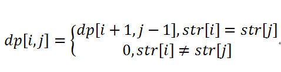

# 动态规划基础

　　虽然我们在（一）中讨论过动态规划的装配线问题，但是究竟什么时候使用动态规划?那么我们就要清楚动态规划方法的最优化问题中的两个要素：最优子结构和重叠子问题。

## 1、**最优子结构**

1）如果问题的一个最优解包含了子问题的最优解，则该问题具有最优子结构。当一个问题具有最优子结构的时候，我们就可能要用到动态规划（贪心策略也是有可能适用的）。

2）寻找最优子结构时，可以遵循一种共同的模式：

1. 问题的一个解可以是一个选择。例如，装配站选择问题。

2. 假设对一个给定的问题，已知的是一个可以导致最优解的选择。不必关心如何确定这个选择，假定他是已知的。

3. 在已知这个选择之后，要确定那些子问题会随之发生，以及如何最好的描述所的得到的子问题空间。

4. 利用一种“剪贴”技术，来证明在问题的一个最优解中，使用的子问题的解本身也必须是最优的。


3）最优子结构在问题域中以两种方式变化：

1. 有多少个子问题被使用在原问题的一个最优解中，以及

2. 再决定一个最优解中使用那些子问题时有多少个选择


在装配线调度问题中，一个最优解只使用了一个子问题，但是，为确定一个最优解，我们必须考虑两种选择。

4）动态规划与贪心算法的区别

　　动态规划以自底向上的方式来利用最优子结构。也就是说，首先找到子问题的最优解，解决的子问题，然后找到问题的一个最优解。寻找问题的一个最优解需要首先在子问题中做出选择，即选择用哪一个来求解问题。问题解的代价通常是子问题的代价加上选择本身带来的开销。

　　在贪心算法中是以自顶向下的方式使用最优子结构。贪心算法会先做选怎，在当时看来是最优的选择，然后在求解一个结果子问题，而不是现寻找子问题的最优解，然后再做选择。

## 2、重叠子问题

　　适用于动态规划求解的最优化问题必须具有的第二个要素是子问题的空间要“很小”，也就是用来解原问题的递归算法可以反复的解同样的子问题，而不是总在产生新的子问题。典型的，不头痛的子问题数十输入规模的一个多项式，当一个递归算法不断的调用同一问题是，我们说该最优问题包含重叠子问题。

　　动态规划算法总是充分利用重叠子问题，即通过每个子问题只解一次，吧解保存在一个需要时就可以查看的表中，而每一次查表得时间为常数。


# 二叉树中的最大路径和

给定一个**非空**二叉树，返回其最大路径和。

本题中，路径被定义为一条从树中任意节点出发，达到任意节点的序列。该路径**至少包含一个**节点，且不一定经过根节点。

**示例 1:**

```
输入: [1,2,3]

       1
      / \
     2   3

输出: 6
```

**示例 2:**

```
输入: [-10,9,20,null,null,15,7]

   -10
   / \
  9  20
    /  \
   15   7

输出: 42
```


**解题思路**

1、最优子结构

因为树是由一个个更小的结点树组成，所以我们可以把问题分解成一个个更小的树。

当树的结点只有一个时，最大的路径就是他自身，让树的高度为2时，根节点的最大路径为左右结点中的最大值加上根节点本身的值：max(l, r) + root.val， 如果左右结点都为负数，还没有自身的值大呢，所以我们取其中的最大值。max_single = max(max(l, r) + root.val, root.val)

知道了二叉树的最优左右路径，我们需要比较整体路径，max_top = max(max_single, l+r+root.val)。

再将以该结点为根节点的二叉树的最大路径和，和全局的路径和比较，取两者最大值，res = max(res, max_top)

2、重叠子问题

从下往上走，当底层的最优路径找出来了， 上一层结点就能直接用下一层的结果,依次向上递推，求解过程都简化成了对若干个个高度为2 的二叉树的操作。当递归完成时，根节点的值就是整颗二叉树的最大路径和。

```python
# Definition for a binary tree node.
# class TreeNode(object):
#     def __init__(self, x):
#         self.val = x
#         self.left = None
#         self.right = None


class Solution(object):
    def maxPathSum(self, root):
        """
        :type root: TreeNode
        :rtype: int
        """
        self.res = float('-inf')
        self.find_max_path_sum(root)

        return self.res

    def find_max_path_sum(self, root):
        """ 
            定义find_max_path_sum(root)为返回path的最大和路径 
            path：经过root的path
        """
        # 空节点
        if not root:
            return 0

        # 最优子结构
        max_left = self.find_max_path_sum(root.left)
        max_right = self.find_max_path_sum(root.right)
        # max_single是以root为根的最大path，不包括left和right同时存在情况，它来作为返回值
        max_single = max(root.val, max(max_left, max_right)+root.val)
        # max_root是以root为根的最大path
        max_root = max(max_single,
                       max_left+max_right+root.val)
        #print("debug:",root.val, max_left, max_right, max_left+max_right+root.val) 

        if self.res <= max_root:
            self.res = max_root
        
        return max_single
        
```


# 最长连续序列

给定一个未排序的整数数组，找出最长连续序列的长度。

要求算法的时间复杂度为 *O(n)*。

**示例:**

```
输入: [100, 4, 200, 1, 3, 2]
输出: 4
解释: 最长连续序列是 [1, 2, 3, 4]。它的长度为 4。
```


**解法 1（时间复杂度O（ nlogn）空间复杂度O（1））**

思路：先对数组进行排序，然后从前向后遍历排序后的数组并且记录最长连续子数组长度。

```java
public  int longestcontinueArrays(int arr[])
    {

        if(arr==null||arr.length==0)
            return 0;
        int longest=0;
        int len=1;
        Arrays.sort(arr);
        //对数组进行排序
        for(int i=0;i<arr.length;i++)
        {
            if(i+1<arr.length&&arr[i]+1==arr[i+1])
            {
                len++;
                longest=Math.max(longest, len);
                //longest 保存当前最长连续数组的长度。
            }
            else {
                len=1;
                //当不连续时将len=1
            }
        }
        return longest;

    }

```


**解法2（时间复杂度O（n），空间复杂度O（n））**

1，2，3，4，5

使用 hashmap 来保存数组中已经遍历过的元素，key对应元素的值，value表示该元素所在的连续子数组的长度。当遍历到数组的一个元素时有以下四种情况： 
1.如果 hashmap 中存在此元素，则遍历下一个元素。 
2.如果hashmap中不存在元素，则看 hashmap中是否存在此元素的前一个元素，比如说如果遍历到5时，看看hashmap中是否存在 4，如果存在则取该连续子数组的第一个元素，将它value值+1，并将该元素放到hashmap中，value值与第一个元素值相同，都表示该连续子数组的长度。 
3.如果hashmap中存在的该元素的后一个元素，遍历到5时，hashmap中是否存在 6，将次元素加入到后一个连续的子数组中，并且和2中一样，找到子数组的第一个元素和最后一个元素，将它们的value值更新为子数组的长度。 

总结：也就是用连续数组的第一个元素和最后一个元素保存数组的长度值，插入一个新的元素到hashmap中时当遇到上面的不同情况时，采用不同的方法更新value值。

```java
public  int longestcontinueArrays(int arr[])
    {
        if(arr==null||arr.length==0)
            return 0;
        int longest=0;
        HashMap<Integer, Integer> hashMap=new HashMap<Integer, Integer>();
        for(int i=0;i<arr.length;i++)
        {
        //遍历数组，如果hashmap中不包含次元素，将其放入到hashmap中
            if(!hashMap.containsKey(arr[i]))
            {
                hashMap.put(arr[i],1);
               //如果hashmap中存在比当前元素小1的元素，则跟上面一样获得连续子数组的第一个元素，进行更新。
                if(hashMap.containsKey(arr[i]-1))
                {
                //合并arr[i]与前面的子数组。
                    longest=Math.max(longest, merge(hashMap, arr[i]-1, arr[i]));
                }
                if(hashMap.containsKey(arr[i]+1))
                {
                //合并arr[i]与后面的连续数组。
                    longest=Math.max(longest, merge(hashMap, arr[i], arr[i]+1));
                }
            }
        }               
        return longest;
    }

public  int merge(HashMap<Integer, Integer> hashMap,int less,int more)
    {
    //合并连续数组，并且更新数组的第一个元素和最后一个元素的value值为合并后的数组的长度。
        int left=less-hashMap.get(less)+1;
        int right=more+hashMap.get(more)-1;
        int len=right-left+1;
        hashMap.put(left, len);
        hashMap.put(right, len);
        return len;
    }

```


# 最长递增子序列(LIS, 编程之美2.16)

序列[1, -1, 2, -3, 4, -5, 6, -7]中，返回最长递增子序列长度为4（如1，2，4，6）

思路分析：

考虑到无后效性，应用动态规划来解决

定义LIS[i]为位置i结束的数组的LIS值，则动态转移方程：

LIS[i+1] = max{1, LIS[j]} , 对于0<=j<=i 并且a[j]<a[i+1]


# Partition Equal Subset Sum 分割等和子集【TODO】

https://blog.csdn.net/qq_26410101/article/details/80806463


# 最长回文子串

[5. 最长回文子串](https://leetcode-cn.com/problems/longest-palindromic-substring/)

给定一个字符串 s，找到 s 中最长的回文子串。你可以假设 s 的最大长度为 1000。

示例 1：

输入: "babad"
输出: "bab"
注意: "aba" 也是一个有效答案。
示例 2：

输入: "cbbd"
输出: "bb"

动态规划的方法，我会在下一篇单独来介绍，这里只说明此题的DP代码

 对于字符串str，假设dp[i,j]=1表示str[i...j]是回文子串，那个必定存在dp[i+1,j-1]=1。这样最长回文子串就能分解成一系列子问题，可以利用动态规划求解了。首先构造状态转移方程



```python
class Solution(object):
    def longestPalindrome(self, s):
        """
        :type s: str
        :rtype: str
        """
        n = len(s)
        if n == 0:
            return ""
        
        if n == 1:
            return s

        max_length = 0
        left,right = -1, -1

        dp = []
        for i in range(0, n):
            dp.append([0]*n)
        
        for j in range(0, n):
            for i in range(j, -1, -1):
                if i == j:
                    dp[i][j] = 1
                    if max_length < j-i+1:
                        max_length = j-i+1
                        left,right = i, j
                    continue
                
                if s[i] == s[j]:
                    dp[i][j] = 1 if j==i+1 else dp[i+1][j-1]
                    if dp[i][j] and max_length<j-i+1:
                        max_length = j-i+1
                        left,right = i, j
                else:
                    dp[i][j] = 0

        return s[left:right+1]

if __name__ == "__main__":
    # s = "babad"
    s = "cbbd"
    print(Solution().longestPalindrome(s))
```

