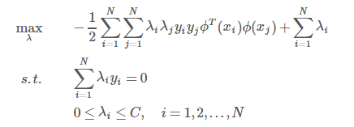

# 1 支持向量机

## 1.1 SVM中的几个核心概念

### 1.1.1 确定超平面及函数间隔

由空间上的平面公式确定超平面 wx+b = 0，且 |wx+b| 表示点 x 到平面上的距离。正类负例位于分割平面两侧，因此y(wx+b) 可同时表示分类正确性以及距离确信度。这也就是函数间隔，其被定义为训练集中所有点到超平面距离的最小值。

### 1.1.2 几何间隔

由于成比例地缩放w和b会使得 |wx+b| 跟着成比例缩放，因此，需要对法向量w加上约束，使得间隔是确定的，也就是函数间隔整体除以 ||w||，也就得到了几何间隔

### 1.1.3 间隔最大化（硬间隔）

分为硬间隔最大和软间隔最大
SVM的基本思想就是求解可以正确划分数据集并且几何间隔最大的分离超平面，其原因是线性可分超平面有无数个，但是间隔最大超平面是唯一的。
间隔最大化的意思就是以充分大的确信度对训练数据进行分类，也就是说，不仅将正负实例分开，同时对最难分的实例点（距离超平面最近的点）也有足够大的确信度将其分离。
此处推出约束优化问题的原始形式（见上一篇博客）

### 1.1.4 支持向量

与超平面最近的点被称为支持向量，也就是使得原始问题约束项成立的点。
实际上离超平面很远的点已经被正确分类，我们让它离超平面更远并没有意义。反而我们最关心是那些离超平面很近的点，这些点很容易被误分类。如果我们可以让离超平面比较近的点尽可能的远离超平面，那么我们的分类效果会好有一些

### 1.1.5  核函数

注意，核函数本质不是将特征映射到高维空间，而是找到一种直接在低位空间对高维空间中向量做点积运算的简便方法。
其证明以及案例可参考李航-统计学习方法 P117

## 1.2 线性可分支持向量机及硬间隔最大化

## 1.3 线性支持向量机及软间隔最大化

## 1.4 非线性支持向量机与核函数

# 2. svm面试题

## 2.1 SVM的原理是什么？

SVM是一种二类分类模型。它的基本模型是在特征空间中寻找间隔最大化的分离超平面的线性分类器。（间隔最大是它有别于感知机）

（1）当训练样本线性可分时，通过硬间隔最大化，学习一个线性分类器，即**线性可分支持向量机**；

（2）当训练数据近似线性可分时，引入松弛变量，通过软间隔最大化，学习一个线性分类器，即**线性支持向量机**；

（3）当训练数据线性不可分时，通过使用核技巧及软间隔最大化，学习**非线性支持向量机**。

注：以上各SVM的数学推导应该熟悉：

- 硬间隔最大化（几何间隔）
- 学习的对偶问题
- 软间隔最大化（引入松弛变量）
- 非线性支持向量机（核技巧）。

## 2.2 SVM为什么采用间隔最大化？

当训练数据线性可分时，存在无穷个分离超平面可以将两类数据正确分开。

感知机利用误分类最小策略，求得分离超平面，不过此时的解有无穷多个。

线性可分支持向量机利用间隔最大化求得最优分离超平面，这时，解是唯一的。另一方面，此时的分隔超平面所产生的分类结果是最鲁棒的，对未知实例的泛化能力最强。

然后应该借此阐述，几何间隔，函数间隔，及从函数间隔—>求解最小化1/2 ||w||^2 时的w和b。即线性可分支持向量机学习算法—最大间隔法的由来。

## 2.3 TODO为什么要将求解SVM的原始问题转换为其对偶问题？

一、是对偶问题往往更易求解（当我们寻找约束存在时的最优点的时候，约束的存在虽然减小了需要搜寻的范围，但是却使问题变得更加复杂。为了使问题变得易于处理，我们的方法是把目标函数和约束全部融入一个新的函数，即拉格朗日函数，再通过这个函数来寻找最优点。）

二、自然引入核函数，进而推广到非线性分类问题。

之所以说换为对偶问题更容易求解，其原因在于降低了算法的计算复杂度。在原问题下，算法的复杂度与样本维度相关，即等于权重w的维度，而在对偶问题下，算法复杂度与样本数量有关，即为拉格朗日算子的个数。
 因此，如果你是做线性分类，且样本维度低于样本数量的话，在原问题下求解就好了，Liblinear之类的线性SVM默认都是这样做的；但如果你是做非线性分类，那就会涉及到升维（比如使用高斯核做核函数，其实是将样本升到无穷维），升维后的样本维度往往会远大于样本数量，此时显然在对偶问题下求解会更好。

另一方面，我们有分析过，只有在支持向量上的样本对应的拉格朗日算子λ才大于0，其余的λ都是=0，而转为对偶问题的计算对象仅有λ，所以大大降低了计算复杂度。

## 2.4 为什么SVM要引入核函数？

​		当样本在原始空间线性不可分时，可将样本从原始空间映射到一个更高维的特征空间，使得样本在这个特征空间内线性可分，引入映射后的对偶问题：

在学习预测中，只定义核函数K(x,y)，而不是显式的定义映射函数ϕ。因为特征空间维数可能很高，甚至可能是无穷维，因此直接计算ϕ(x)·ϕ(y)是比较困难的。相反，直接计算K(x,y)比较容易（即直接在原来的低维空间中进行计算，而不需要显式地写出映射后的结果）。

核函数的定义：K(x,y)=<ϕ(x),ϕ(y)>，即在特征空间的内积等于它们在原始样本空间中通过核函数K计算的结果。

除了 SVM 之外，任何将计算表示为数据点的内积的方法，都可以使用核方法进行非线性扩展。

## **2.5 为什么SVM对缺失数据敏感？**

​		这里说的缺失数据是指缺失某些特征数据，向量数据不完整。SVM没有处理缺失值的策略（决策树有）。而SVM希望样本在特征空间中线性可分，所以特征空间的好坏对SVM的性能很重要。缺失特征数据将影响训练结果的好坏。

## 2.6 SVM如何处理多分类问题？

一般有两种做法：

一种是**直接法**，直接在目标函数上修改，将多个分类面的参数求解合并到一个最优化问题里面。看似简单但是计算量却非常的大。

另外一种做法是**间接法**：对训练器进行组合。其中比较典型的有一对一，和一对多。

一对多，就是对每个类都训练出一个分类器，由svm是二分类，所以将此而分类器的两类设定为目标类为一类，其余类为另外一类。这样针对k个类可以训练出k个分类器，当有一个新的样本来的时候，用这k个分类器来测试，那个分类器的概率高，那么这个样本就属于哪一类。这种方法效果不太好，bias比较高。

svm一对一法（one-vs-one），针对任意两个类训练出一个分类器，如果有k类，一共训练出C(2,k) 个分类器，这样当有一个新的样本要来的时候，用这C(2,k) 个分类器来测试，每当被判定属于某一类的时候，该类就加一，最后票数最多的类别被认定为该样本的类。