# 基本的概念

boosting 提升方法

gradient boosting 梯度提升

gradient boosting decision tree 梯度提升决策树

MART(multiple additive regression tree) 多重累加回归树

# **理解 Boosting、树方法和树提升**

boosting 拟合同一类的集成模型（ensemble model）：

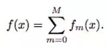

其可以被写成自适应基函数模型：

多数 boosting 算法都可以看作是在每次迭代时或准确或近似地求解

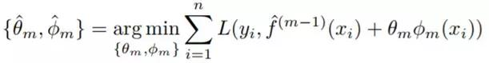

## 梯度提升

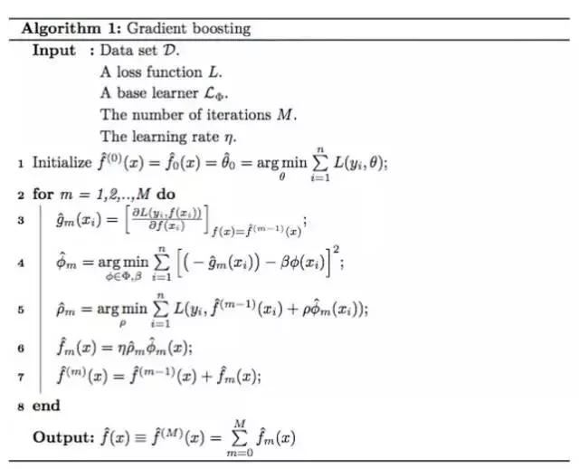

## 牛顿提升

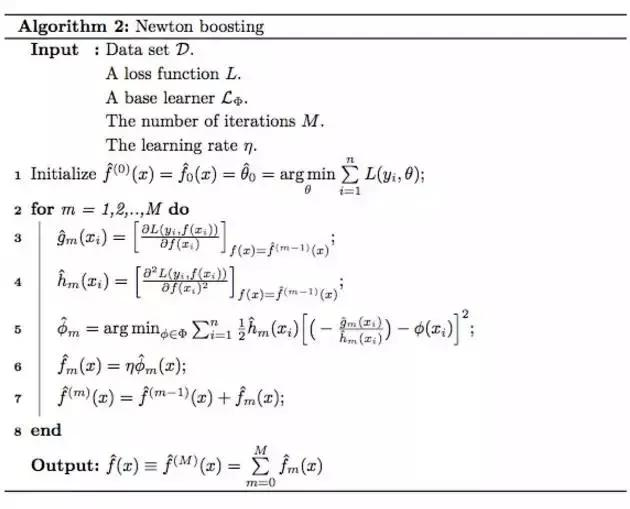

- 是梯度
- 是使用数据学习到的弱学习器
- 是经验 Hessian

- 梯度提升：是由线搜索（line search）确定的步长
- 牛顿提升： h_m(x) 是经验 Hessian

# **树方法**

树模型是简单和可解释的模型。它们的预测能力确实有限，但将多个树模型组合到一起（比如 bagged trees、随机森林或在 boosting 中），它们就可以变成一种强大的预测模型。

我们可以将树模型看作是将特征空间分割成几个不同的矩形和非重叠区域集合，然后它可以拟合一些简单的模型。下图给出了使用 Boston Housing 数据得到的可视化结果：

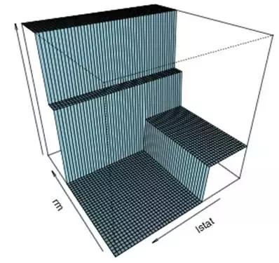

终端节点的数量和树的深度可以看作是树模型的复杂度度量。为了泛化这种模型，我们可以在复杂度度量上轻松地应用一个复杂度限制，或在终端节点的数量或叶权重的惩罚项上应用一个惩罚（XGBoost 使用的这种方法）。

因为学习这种树的结构是 NP 不完全的，所以学习算法往往会计算出一个近似的解。这方面有很多不同的学习算法，比如 CART（分类和回归树）、C4.5 和 CHAID。这篇论文描述了 CART，因为 MART 使用的 CART，XGBoost 也实现了一种与 CART 相关的树模型。

CART 以一种自上而下的方式生长树。通过考虑平行于坐标轴的每次分割，CART 可以选择最小化目标的分割。在第二步中，CART 会考虑每个区域内每次平行的分割。在这次迭代结束时，最好的分割会选出。CART 会重复所有这些步骤，直到达到停止标准。

给定一个区域 Rj，学习其权重 wj 通常很简单。令 Ij 表示属于区域 Rj 的索引的集合，即 xi∈Rj，其中 i∈Ij。

其权重是这样估计的：

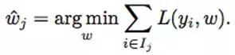

对于一个树模型 f_hat，经验风险为：

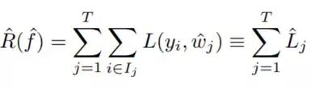

其中我们令 L_j hat 表示节点 j 处的累积损失。在学习过程中，当前树模型用 f_before hat 和 f_after hat 表示。

我们可以计算所考虑的分割所带来的增益：

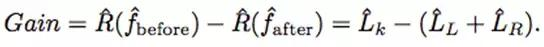

对于每一次分割，每个可能节点的每个可能分割都会计算这种增益，再取其中最大的增益。

现在让我们看看缺失值。CART 会使用替代变量（surrogate variable）来处理缺失值，即对于每个预测器，我们仅使用非缺失数据来寻找分割，然后再基于主分割寻找替代预测因子，从而模拟该分割。比如，假设在给定的模型中，CART 根据家庭收入分割数据。如果一个收入值不可用，那么 CART 可能会选择教育水平作为很好的替代。

但 XGBoost 是通过学习默认方向来处理缺失值。XGBoost 会在内部自动学习当某个值缺失时，最好的方向是什么。这可以被等价地看作是根据训练损失的减少量而自动「学习」缺失值的最佳插补值。

根据类别预测器，我们可以以两种方式处理它们：分组类别或独立类别。CART 处理的是分组类别，而 XGBoost 需要独立类别（one-hot 编码）。

这篇论文以列表的形式总结了树模型的优缺点。优点（Hastie et al., 2009; Murphy, 2012）：

- •容易解释
- •可以相对快地构建
- •可以自然地处理连续和分类数据
- •可以自然地处理缺失数据
- •对输入中的异常值是稳健的
- •在输入单调变换时是不变的
- •会执行隐式的变量选择
- •可以得到数据中的非线性关系
- •可以得到输入之间的高阶交互
- •能很好地扩展到大型数据集

缺点（Hastie et al., 2009; Kuhn and Johnson, 2013; Wei-Yin Loh, 1997; Strobl et al., 2006）：

- •往往会选择具有更高数量的不同值的预测器
- •当预测器具有很多类别时，可能会过拟合
- •不稳定，有很好的方差
- •缺乏平滑
- •难以获取叠加结构
- •预测性能往往有限

# **树提升**

## 提升树模型（boosting tree model）

在上述发展的基础上，现在我们将 boosting 算法与基本学习器树方法结合起来。提升后的树模型可以看作是自适应基函数模型，其中的基函数是回归树：

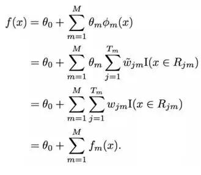

提升树模型（boosting tree model）是多个树 fm 的和，所以也被称为树集成（tree ensemble）或叠加树模型（additive tree model）。因此它比单个树模型更加平滑，如下图所示：

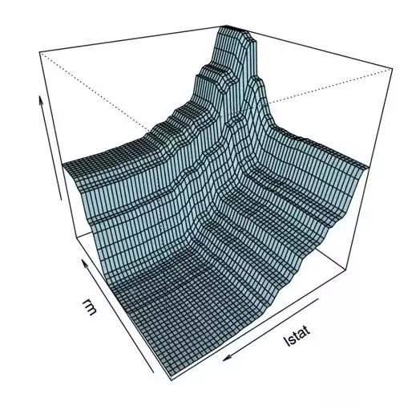

拟合 Boston Housing 数据的叠加树模型的可视化

## 在提升树模型上实现正则化方法

\1. 在基函数扩展上进行正则化

\2. 在各个树模型上进行正则化

\3. 随机化

一般来说，提升树往往使用很浅的回归树，即仅有少数终端节点的回归树。相对于更深度的树，这样的方差较低，但偏置更高。这可以通过应用复杂度约束来完成。

XGBoost 相对于 MART 的优势之一是复杂度的惩罚，这对叠加树模型而言并不常见。目标函数的惩罚项可以写成：

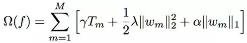

其中第一项是每个单个树的终端节点的数量，第二项是在该项权重上的 L2 正则化，最后一项是在该项权重上的 L1 正则化。

Friedman(2002) 最早引入了随机化，这是通过随机梯度下降实现的，其中包括在每次迭代时进行行子采样（row subsampling）。随机化有助于提升泛化性能。子采样的方法有两种：行子采样与列子采样（column subsampling）。MART 仅包含行子采样（没有替代），而 XGBoost 包含了行子采样和列子采样两种。

## GTB（梯度树提升）和 NTB（牛顿树提升）

正如前面讨论的那样，MART 和 XGBoost 使用了两种不同的 boosting 算法来拟合叠加树模型，分别被称为 GTB（梯度树提升）和 NTB（牛顿树提升）。这两种算法都是要在每一次迭代 m 最小化：

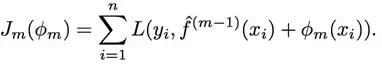

其基函数是树：

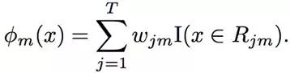

其一般步骤包含 3 个阶段：

\1. 确定一个固定的候选树结构的叶权重 ；

\2. 使用前一阶段确定的权重，提出不同的树结构，由此确定树结构和区域；

\3. 一旦树结构确定，每个终端节点中的最终叶权重（其中 j=1,..,T）也就确定了。

算法 3 和 4 使用树作为基函数，对算法 1 和 2 进行了扩展：

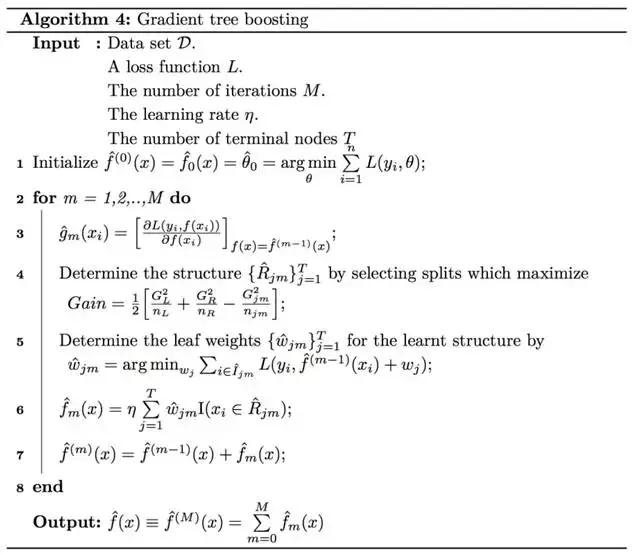

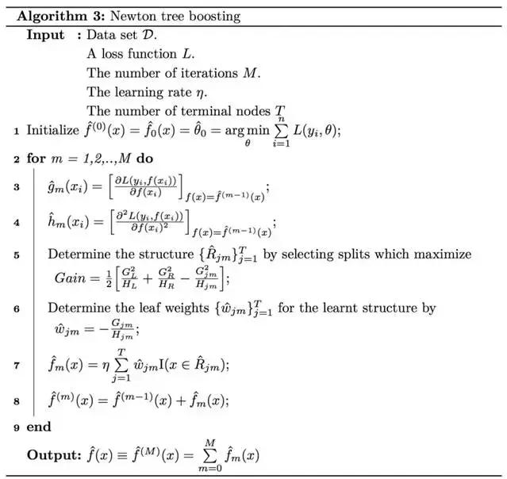

**XGBoost 和 MART 的差异**

最后，论文对两种树提升算法的细节进行了比较，并试图给出 XGBoost 更好的原因。

## XGBoost 和 MART 的差异

### 模型层面的比较

正如之前的章节所讨论的那样，XGBoost 和 MART 都是要通过简化的 FSAM（Forward Stage Additive Modelling/前向阶段叠加建模）求解同样的经验风险最小化问题：

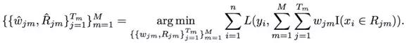

即不使用贪婪搜索，而是每次添加一个树。在第 m 次迭代时，使用下式学习新的树：

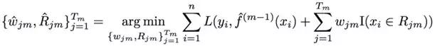

XGBoost 使用了上面的算法 3，即用牛顿树提升来近似这个优化问题。而 MART 使用了上面的算法 4，即用梯度树提升来做这件事。这两种方法的不同之处首先在于它们学习树结构的方式，然后还有它们学习分配给所学习的树结构的终端节点的叶权重的方式。

再看看这些算法，我们可以发现牛顿树提升有 Hessian 矩阵，其在确定树结构方面发挥了关键性的作用，XGBoost：

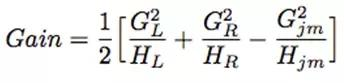

而使用了梯度树提升的 MART 则是：

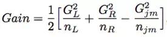

然后，XGBoost 可以直接这样定义牛顿树提升的叶权重：

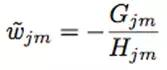

使用梯度树提升的 MART 则这样定义：

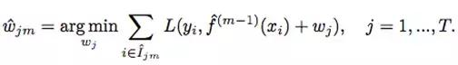

总结一下，XGBoost 使用的 Hessian 是一种更高阶的近似，可以学习到更好的树结构。但是，MART 在确定叶权重上表现更好，但却是对准确度更低的树结构而言。

在损失函数的应用性方面，牛顿树提升因为要使用 Hessian 矩阵，所以要求损失函数是二次可微的。所以它在选择损失函数上要求更加严格，必须要是凸的。

当 Hessian 每一处都等于 1 时，这两种方法就是等价的，这就是平方误差损失函数的情况。因此，如果我们使用平方误差损失函数之外的任何损失函数，在牛顿树提升的帮助下，XGBoost 应该能更好地学习树结构。只是梯度树提升在后续的叶权重上更加准确。因此无法在数学上对它们进行比较。

### **正则化比较**

正则化参数实际上有 3 类：

1.boosting 参数：树的数量 M 和学习率η

\2. 树参数：在单个树的复杂度上的约束和惩罚

\3. 随机化参数：行子采样和列子采样

两种 boosting 方法的主要差别集中在树参数以及随机化参数上。

对于树参数，MART 中的每个树都有同样数量的终端节点，但 XGBoost 可能还会包含终端节点惩罚 γ，因此其终端节点的数量可能会不一样并且在最大终端节点数量的范围内。XGBoost 也在叶权重上实现了 L2 正则化，并且还将在叶权重上实现 L1 正则化。

在随机化参数方面，XGBoost 提供了列子采样和行子采样；而 MART 只提供了行子采样。

# 从参数空间到函数空间

## 牛顿法

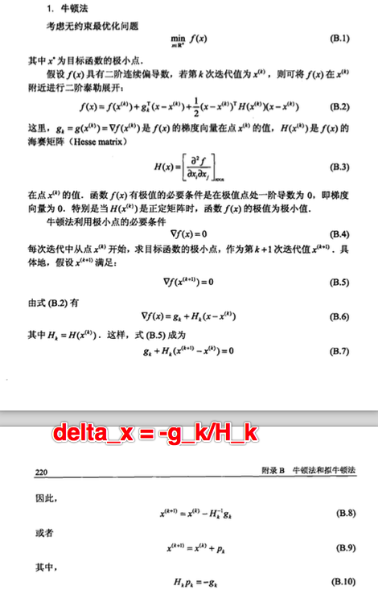

从参数空间到函数空间

- GBDT在函数空间中利用梯度下降进行优化
- XGB在函数空间利用牛顿法进行优化

## **梯度下降从参数空间到函数空间**

v

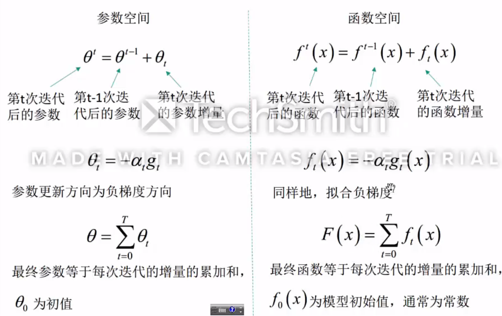

对于函数空间，仅仅是将参数的拟合换为函数的拟合，每次仍然迭代的是一个负梯度，只是其最终得到的是增量函数的累加而不是增量参数累加。

GBDT里，迭代项ft(x)就是我们的决策树，最终将每棵决策树的预测值（函数）加起来。

## **牛顿法从参数空间到函数空间**

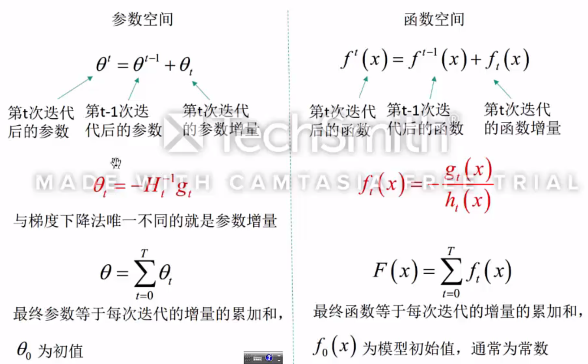

对于牛顿法的函数空间优化，其方法类似于梯度下降的函数空间优化

**3. boosting算法小结**
 无论是梯度下降还是牛顿法，其函数空间上的boosting优化模型都看作是一类加法模型，相加的对象可以是一系列弱分类器或是回归树。

**4. 牛顿法小结**
 牛顿法是梯度下降的进一步优化，梯度下降利用目标函数的一阶偏导信息，以负梯度方向作为搜索方向，只考虑目标函数在迭代点的局部性质；而牛顿法不仅使用目标函数的一阶偏导数，还进一步利用了目标函数的二阶偏导，这样就考虑了梯度变化的趋势，因而能更全面地确定合适的搜索方向以加快收敛。

# xgboost到Newton Tree Boosting

如何完整的推导xgboost(按照陈天奇slide)，并且把xgboost的推导推广到newton tree boosting

Introduction to Boosted Trees

https://xgboost.readthedocs.io/en/latest/tutorials/model.html

没有想象中那么复杂！

# xgboost相比于GBDT的创新之处：

参考wepon的博客

http://wepon.me/2016/05/07/XGBoost%E6%B5%85%E5%85%A5%E6%B5%85%E5%87%BA/

- 传统GBDT以CART作为基分类器，**xgboost还支持线性分类器**，这个时候xgboost相当于带L1和L2正则化项的逻辑斯蒂回归（分类问题）或者线性回归（回归问题）。
- 传统GBDT在优化时只用到一阶导数信息，**xgboost则对代价函数进行了二阶泰勒展开**，同时用到了一阶和二阶导数。顺便提一下，xgboost工具支持自定义代价函数，只要函数可一阶和二阶求导。
- **xgboost在代价函数里加入了正则项**，用于控制模型的复杂度。正则项里包含了树的叶子节点个数、每个叶子节点上输出的score的L2模的平方和。从Bias-variance tradeoff角度来讲，正则项降低了模型的variance，使学习出来的模型更加简单，防止过拟合，这也是xgboost优于传统GBDT的一个特性。
- **Shrinkage（缩减）**，相当于学习速率（xgboost中的eta）。xgboost在进行完一次迭代后，会将叶子节点的权重乘上该系数，主要是为了削弱每棵树的影响，让后面有更大的学习空间。实际应用中，一般把eta设置得小一点，然后迭代次数设置得大一点。（补充：传统GBDT的实现也有学习速率）
- **列抽样（column subsampling）**。xgboost借鉴了随机森林的做法，支持列抽样，不仅能降低过拟合，还能减少计算，这也是xgboost异于传统gbdt的一个特性。

- **对缺失值的处理**。对于特征的值有缺失的样本，xgboost可以自动学习出它的分裂方向。
- **xgboost工具支持并行**。boosting不是一种串行的结构吗?怎么并行的？注意xgboost的并行不是tree粒度的并行，xgboost也是一次迭代完才能进行下一次迭代的（第t次迭代的代价函数里包含了前面t-1次迭代的预测值）。xgboost的并行是在特征粒度上的。我们知道，决策树的学习最耗时的一个步骤就是对特征的值进行排序（因为要确定最佳分割点），xgboost在训练之前，预先对数据进行了排序，然后保存为block结构，后面的迭代中重复地使用这个结构，大大减小计算量。这个block结构也使得并行成为了可能，在进行节点的分裂时，需要计算每个特征的增益，最终选增益最大的那个特征去做分裂，那么各个特征的增益计算就可以开多线程进行。

- **可并行的近似直方图算法**。树节点在进行分裂时，我们需要计算每个特征的每个分割点对应的增益，即用贪心法枚举所有可能的分割点。当数据无法一次载入内存或者在分布式情况下，贪心算法效率就会变得很低，所以xgboost还提出了一种可并行的近似直方图算法，用于高效地生成候选的分割点。

=============

回复 @肖岩在评论里的问题，因为有些公式放正文比较好。评论里讨论的问题的大意是 “xgboost代价函数里加入正则项，是否优于cart的剪枝”。其实陈天奇大神的slides里面也是有提到的，我当一下搬运工。
决策树的学习过程就是为了找出最优的决策树，然而从函数空间里所有的决策树中找出最优的决策树是NP-C问题，所以常采用启发式（Heuristic）的方法，如CART里面的优化GINI指数、剪枝、控制树的深度。这些启发式方法的背后往往隐含了一个目标函数，这也是大部分人经常忽视掉的。xgboost的目标函数如下：

其中正则项控制着模型的复杂度，包括了叶子节点数目T和leaf score的L2模的平方：

那这个跟剪枝有什么关系呢？？？
跳过一系列推导，我们直接来看xgboost中树节点分裂时所采用的公式：

这个公式形式上跟ID3算法（采用entropy计算增益） 、CART算法（采用gini指数计算增益） 是一致的，都是用分裂后的某种值 减去 分裂前的某种值，从而得到增益。为了限制树的生长，我们可以加入阈值，当增益大于阈值时才让节点分裂，上式中的gamma即阈值，它是正则项里叶子节点数T的系数，所以xgboost在优化目标函数的同时相当于做了预剪枝。另外，上式中还有一个系数lambda，是正则项里leaf score的L2模平方的系数，对leaf score做了平滑，也起到了防止过拟合的作用，这个是传统GBDT里不具备的特性。

# 参考文献

为什么XGBoost在机器学习竞赛中表现如此卓越？

https://www.jiqizhixin.com/articles/2017-11-08-3

从参数空间到函数空间理解GBDT+XGBoost

https://www.jianshu.com/p/6075922a8bc3

XGBoost浅入浅出

http://wepon.me/2016/05/07/XGBoost%E6%B5%85%E5%85%A5%E6%B5%85%E5%87%BA/

Introduction to Boosted Trees

https://xgboost.readthedocs.io/en/latest/tutorials/model.html

TODO

https://zhuanlan.zhihu.com/p/38297689

# TODO

xgboost如何做分类的