## **一、模型定**义

Logistic Regression是一种分类方法，用于两分类问题（即输出只有两种）。先找到一个预测函数（**h**），该函数的输出必须是两个值（分别代表两个类别），利用了Sigmoid函数，函数形式为：

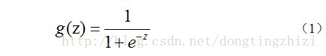        

对应的函数图像是一个取值在0和1之间的S型曲线（图1）。

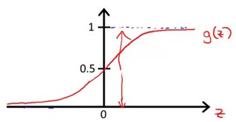 

图1

 

利用sigmoid函数，定义一个预测函数为：

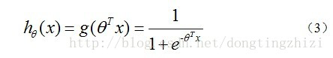

*hθ(x)*函数值表示结果取1的概率，因此对于输入x分类结果为类别1和类别0的概率分别为：

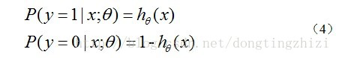

 

## 二、模型参数估计

应用极大似然估计法估计模型参数

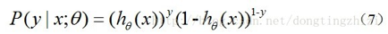

似然函数为：

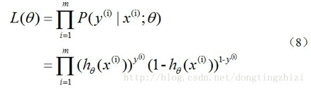

对数似然函数为：

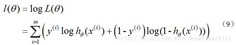

最大似然估计就是要求得使-**l(θ**)取最小值时的**θ**，这里可以使用梯度下降法求解，求得的**θ**就是要求的最佳参数，即

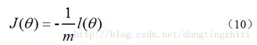

根据梯度下降法可得**θ**的更新过程：

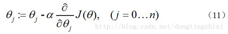

式中为*α*学习步长，下面来求偏导：

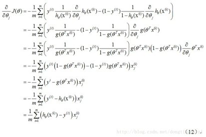 

更新过程可以写成：

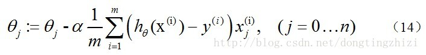

## 三、Logistic回归多分类

logistic回归的损失函数改为如下形式：

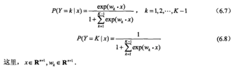

## 问题

### 问题1：为什么是交叉熵损失函数

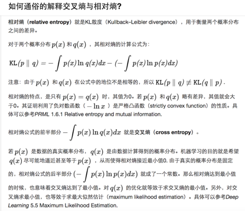

 

  

### 问题2：为什么是sigmoid函数

逻辑回归是广义线性模型的一种特殊形式，或者说是广义线性模型的一个特例，当我们模型假设服从伯努利分布的情况下，那我们的求解目标或者假设函数就是sigmoid函数。

在广义线性模型下 我们只需要把符合指数分布的一般模型的参数转换成它对应的广义线性模型参数，然后按照广义线性模型的求解步骤即可轻松求解问题。

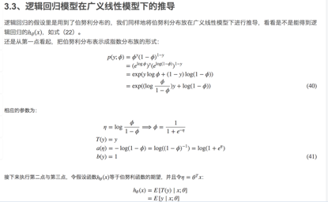

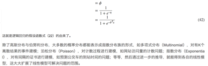

当模型假设服从正态分布的情况下，那我们的求解模型就是线性回归

当模型假设服从多项式分布的情况下，那我们的求解模型就是softmax回归

 

 

## 参考链接

1、如何通俗的解释交叉熵与相对熵?

<https://www.zhihu.com/question/41252833/answer/141598211>

2、Gibbs' inequality

https://en.wikipedia.org/wiki/Gibbs%27_inequality

3、线性回归、logistic回归、广义线性模型——斯坦福CS229机器学习个人总结

<https://blog.csdn.net/sinat_37965706/article/details/69204397>

<https://www.cnblogs.com/wallacup/p/6024855.html?utm_source=itdadao&utm_medium=referral>

4、Logistic回归做多分类和Softmax回归

https://www.cnblogs.com/Rambler1995/p/5467071.html