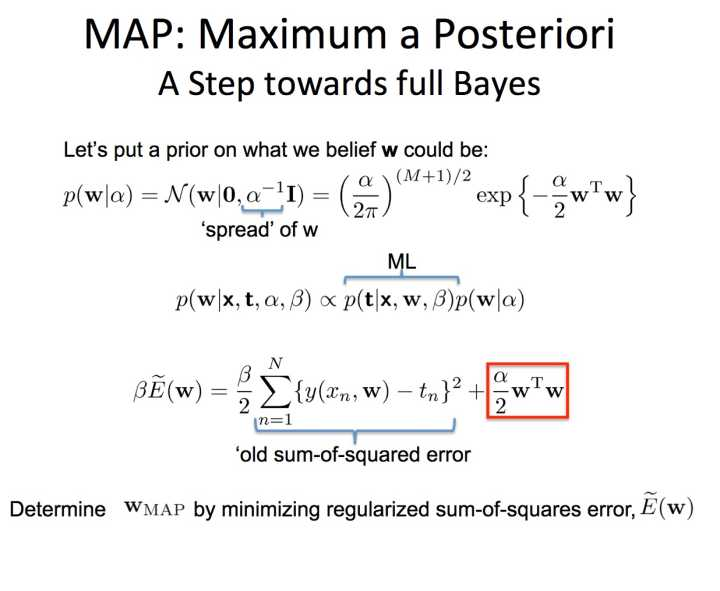
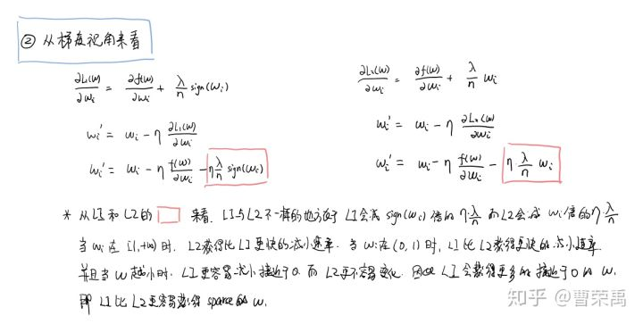
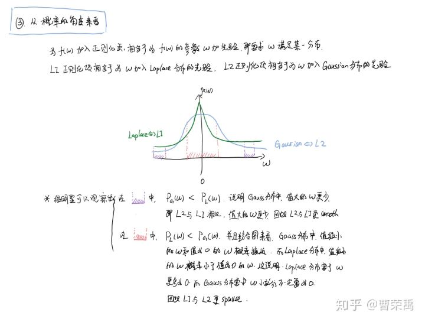
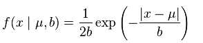
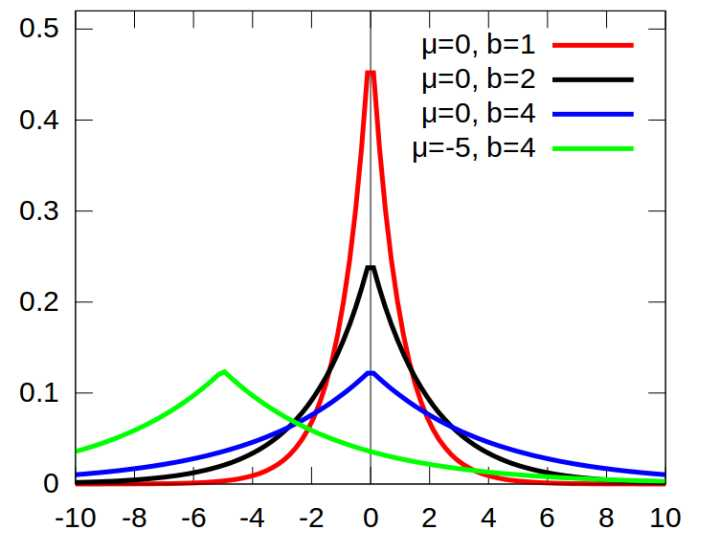

# 1. 机器学习中使用正则化来防止过拟合是什么原理？

## 1.1 过拟合

​		引用周老师西瓜书中的解释：“当学习器把训练样本学得“太好”了的时候，很可能已经把训练样本本身的一些特点当做了所有潜在样本都会具有的一般性质，这样就会导致泛化性能下降，这种现象就是机器学习中的过拟合”。

## 1.2 从贝叶斯角度【TODO】：

​		过拟合表现在训练数据上的误差非常小，而在测试数据上误差反而增大。其原因一般是模型过于复杂，过分得去拟合数据的噪声和outliers.  **正则化则是对模型参数添加先验**，使得模型复杂度较小，对于噪声以及outliers的输入扰动相对较小。  以正则化项和损失函数都是l_2 norm 为例，下面贴一张上课用的slide.

​		**我们相当于是给模型参数w 添加了一个协方差为1/alpha 的零均值高斯分布先验。 对于alpha =0，也就是不添加正则化约束，则相当于参数的高斯先验分布有着无穷大的协方差，那么这个先验约束则会非常弱，模型为了拟合所有的训练数据，w可以变得任意大不稳定。****alpha越大，表明先验的高斯协方差越小，模型约稳定， 相对的variance也越小。** 也正如其他答题者所说， 加入正则化是 **在bias和variance之间做一个tradeoff.**

## 1.3 从结构风险最小化

结构风险最小化 = 经验风险最小化+正则项

# 2. L1正则与L2正则

## 2.1 L1正则为什么相对L2正则会获得稀疏解

### 从优化问题视角（几何角度）

其中正则项对wi的负梯度方向，与粉红色的相反

并且你可以尝试把w移动，L1正则情形下的方向还是倾向把w1取值到0，L2正则就不是这种情况了

### 从梯度问题视角（求导）

它这里只是为了说明L1为什么相比L2更容易获得稀疏解，而没有更具体的解释为什么L1获得稀疏解

可以这样解释，当x在[-1, 1]之间时，L1情形下的第三项，使得wi迅速的向0值靠近

### 从概率的角度（先验分布）

另外：

L1，L2范式来自于对数据的先验知识.如果你认为，你现有的数据来自于高斯分布，那么就应该在代价函数中加入数据先验P(x)，一般由于推导和计算方便会加入对数似然，也就是log(P(x))，然后再去优化，这样最终的结果是，由于你的模型参数考虑了数据先验，模型效果当然就更好.如果你去看看高斯分布的概率密度函数P(x)，你会发现取对数后的log(P(x))就剩下一个平方项了，这就是L2范式的由来--高斯先验.
同样，如果你认为你的数据是稀疏的，不妨就认为它来自某种laplace分布.laplace分布是尖尖的分布，从laplace分布图上，你应该就能看出，服从laplace分布的数据就是稀疏的了(只有很小的概率有值，大部分概率值都很小或为0).那么，加入了laplace先验作为正则项的代价函数是什么?再看看laplace分布的概率密度函数，如果取对数，剩下的是一个一次项|x-u|，这就是L1范式.所以用L1范式去正则，就假定了你的数据是laplace分布，是稀疏的.

来源：

https://www.zhihu.com/question/37096933

# 附录：

## laplace分布

概率密度函数(还是来自维基百科)

