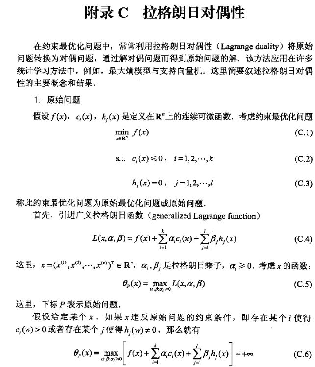
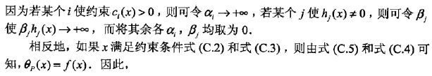
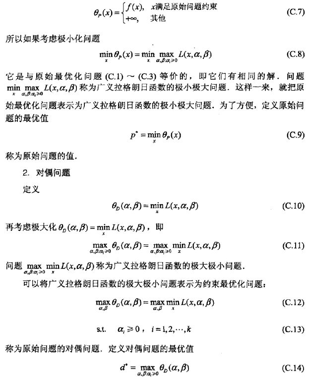
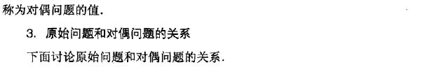
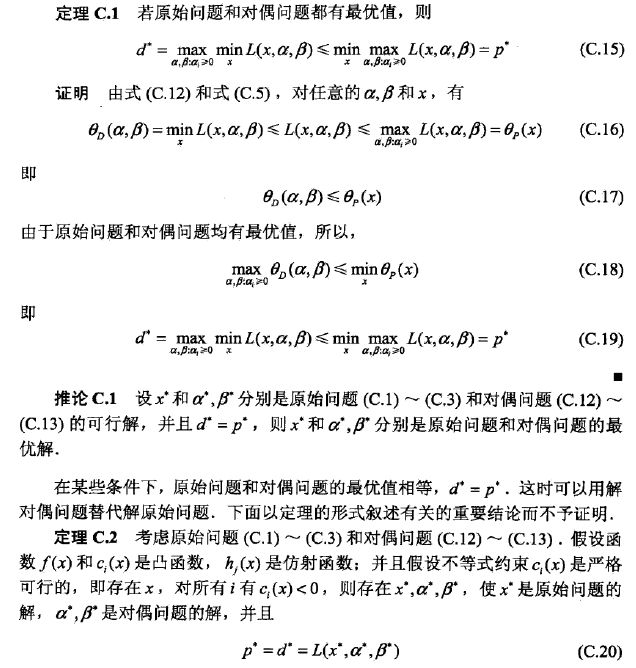
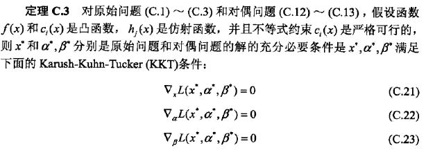
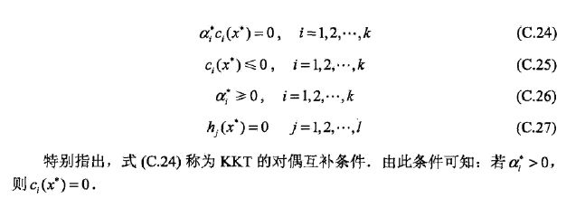

​		在约束最优化问题中，常常利用拉格朗日对偶性将原始问题，转换为对偶问题，通过解对偶问题而得到原始问题的解。该方法常见于最大熵模型与支持向量机，最大熵还没有看到，但是支持向量机肯定有的。我主要瞄了附录C，发现写的很好，当原始问题的函数和约束条件满足一定的条件，就可以得出原始问题和对偶问题的最优解是相同的，而且，满足定理C.2的话，最优解会满足KKT条件。

#### 原始问题

原始最优化问题

广义拉格朗日函数的极小极大问题

这两者可证明是等价的，所以后者也称为原始问题

#### 对偶问题

广义拉格朗日函数的极大极小问题

对偶问题

来源：李航《统计学习方法》