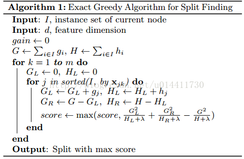
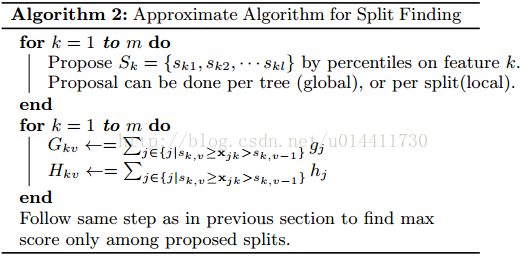
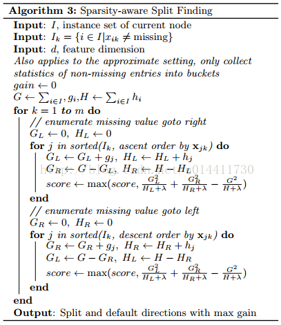
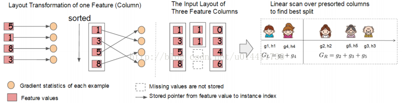
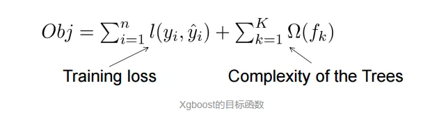
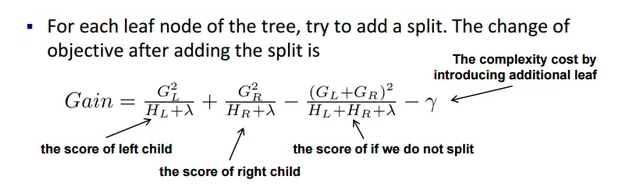

# 1. 理论部分（提升树算法的介绍）

# 2. 工程实现（论文）[TODO]

重点关注xgboost在工程层面的实现！

## 2.1 分割算法

### 2.1.1 基础精确的贪心算法

​		xgboost中***树节点分裂时所采用的公式***关键问题是找到合适的分割，精确的贪心算法通过列举所有特征的可能划分找到最优划分解，许多单机Tree算法使用这种方式找到划分点，例如 sklearn、Rs gbm、单机的XGBoost。精确的算法需要排序成连续的特征，之后计算每个可能划分的梯度统计值，如下算法：

### 2.1.2 近似算法

​		精确通过列举特征所有可能的划分，耗时，当数据量大的时候，几乎不可能将数据全部加载进内存，精确划分在分布式中也会有问题。我们总结了近似的策略，如算法二所示，算法首先根据特征分布的百分比提议候选划分点，之后按照候选划分点将特征映射到槽中，找到最好的划分百分点。全局划分需要尽可能详细的特征划分，局部划分初步就能达到要求。在分布式树中许多存在的近似算法都使用这个策略，也可以直接构造直方图近似（lightGBM直方图近似，速度更快，好像准确度有所降低），也可以使用其他的策略而不仅仅是分位法，分位策略便于分布式实现、计算方便。

### 2.1.4 Sparsity-aware Split Finding

​		**稀疏自适应分割策略**，很多时候训练数据都是稀疏的（如TF-IDF），数据都是有缺失值的。很多机器学习的算法都是没有具体办法处理稀疏数据，如SVM，NN等。XGB训练数据的时候，它使用没有缺失的数据去进行节点分支，然后我们将特征上缺失的数据尝试放左右节点上，看缺失值应当分到那个分支节点上。我们把缺失值分配到的分支称为默认分支。

### 2.1.5 缺失值的处理

参考如上内容：

XGB训练数据的时候，它使用没有缺失的数据去进行节点分支，然后我们将特征上缺失的数据尝试放左右节点上，看缺失值应当分到那个分支节点上。我们把缺失值分配到的分支称为默认分支。

## 2.2 系统设计-适应于并行学习的列块

​		利用列块进行并行计算：在我们训练过程中我们主要是做分支处理，分支处理就要对每一列（特征）找出适合的分裂点。通常来说，我们更青睐使用csc存储，这样我们就方便取出来。再者我们在分支的时候都会预先对数据按照其特征值进行排序。所以我们将数据按照列存储成一个数据块方便我们在分支的时候并行处理。**所以我们要知道XGB的并行计算的粒度不在树上，而是在特征上，尤其是不同分支节点上（leaf-wise）。**

​		当然这也成为XGB的一个问题所在，**需要额外的空间存储pre-sort的数据**。而且每次分支后，我们都要找处落在下一个子节点上的样本，并组织好它。

**后来就有了LightGBM，下次我再将其整理出来**。

# 3. xgboost问题

## 3.1 XGBoost的正则化是如何实现的（工程能力）

​		决策树的学习过程就是为了找出最优的决策树，然而从函数空间里所有的决策树中找出最优的决策树是NP-C问题，所以常采用启发式（Heuristic）的方法，如CART里面的优化GINI指数、剪枝、控制树的深度。这些启发式方法的背后往往隐含了一个目标函数。

xgboost的目标函数如下：

其中正则项控制着模型的复杂度，包括了叶子节点数目T和leaf score的L2模的平方：

## 3.2 xgboost 在什么地方做的剪枝，怎么做的？

类似问题：xgboost代价函数里加入正则项，是否优于cart的剪枝?

​		决策树的学习过程就是为了找出最优的决策树，然而从函数空间里所有的决策树中找出最优的决策树是NP-C问题，所以常采用启发式（Heuristic）的方法，如CART里面的优化GINI指数、剪枝、控制树的深度。这些启发式方法的背后往往隐含了一个目标函数。

xgboost的目标函数如下：

其中正则项控制着模型的复杂度，包括了叶子节点数目T和leaf score的L2模的平方：

跳过一系列推导，我们直接来看xgboost中***树节点分裂时所采用的公式***：

​		这个公式形式上跟ID3算法（采用entropy计算增益） 、CART算法（采用gini指数计算增益） 是一致的，都是用**分裂后的某种值 减去 分裂前的某种值**，从而得到增益。为了限制树的生长，我们可以加入阈值，当增益大于阈值时才让节点分裂，上式中的gamma即阈值，它是正则项里叶子节点数T的系数，所以<u>xgboost在优化目标函数的同时相当于做了预剪枝</u>。另外，上式中还有一个系数lambda，是正则项里leaf score的L2模平方的系数，**对leaf score做了平滑，也起到了防止过拟合的作用**，**这个是传统GBDT里不具备的特性**。

## 3.3 xgboost 如何分布式？

特征分布式和数据分布式？ 各有什么存在的问题？

参考2.2

## 3.4 XGBoost的参数调优有哪些经验（工程能力）

### 3.4.1 Scikit-Learn API

Scikit-Learn Wrapper interface for XGBoost.

- *class* `xgboost.``XGBRegressor`(*max_depth=3*, *learning_rate=0.1*, *n_estimators=100*, *verbosity=1*, *silent=None*, *objective='reg:squarederror'*, *booster='gbtree'*, *n_jobs=1*, *nthread=None*, *gamma=0*, *min_child_weight=1*, *max_delta_step=0*, *subsample=1*, *colsample_bytree=1*, *colsample_bylevel=1*, *colsample_bynode=1*, *reg_alpha=0*, *reg_lambda=1*, *scale_pos_weight=1*, *base_score=0.5*, *random_state=0*, *seed=None*, *missing=None*, *importance_type='gain'*, ***kwargs*)
- *class* `xgboost.``XGBClassifier`**(***max_depth=3***,** *learning_rate=0.1***,** *n_estimators=100***,** *verbosity=1***,** *silent=None***,** *objective='binary:logistic'***,** *booster='gbtree'***,** *n_jobs=1***,** *nthread=None***,** *gamma=0***,** *min_child_weight=1***,** *max_delta_step=0***,** *subsample=1***,** *colsample_bytree=1***,** *colsample_bylevel=1***,** *colsample_bynode=1***,** *reg_alpha=0***,** *reg_lambda=1***,** *scale_pos_weight=1***,** *base_score=0.5***,** *random_state=0***,** *seed=None***,** *missing=None***,** ***kwargs***)**

### 3.4.2 XGBoost的参数分了三类：

1. 通用参数：宏观函数控制。
2. Booster参数：控制每一步的booster(tree/regression)。
3. 学习目标参数：控制训练目标的表现。

#### 通用参数

这些参数用来控制XGBoost的宏观功能。

1、booster[默认gbtree]
选择每次迭代的模型，有两种选择：
**gbtree：基于树的模型**
gbliner：线性模型
2、silent[默认0]
当这个参数值为1时，静默模式开启，不会输出任何信息。
一般这个参数就保持默认的0，因为这样能帮我们更好地理解模型。
3、nthread[默认值为最大可能的线程数]
这个参数用来进行多线程控制，应当输入系统的核数。
如果你希望使用CPU全部的核，那就不要输入这个参数，算法会自动检测它。
还有两个参数，XGBoost会自动设置，目前你不用管它。接下来咱们一起看booster参数。

#### booster参数

尽管有两种booster可供选择，我这里只介绍tree booster，因为它的表现远远胜过linear booster，所以linear booster很少用到。

1、eta[默认0.3]
和GBM中的 learning rate 参数类似。
通过减少每一步的权重，可以提高模型的鲁棒性。
典型值为0.01-0.2。
2、min_child_weight[默认1]
决定最小叶子节点样本权重和。
和GBM的 min_child_leaf 参数类似，但不完全一样。XGBoost的这个参数是最小样本权重的和，而GBM参数是最小样本总数。
这个参数用于避免过拟合。当它的值较大时，可以避免模型学习到局部的特殊样本。
但是如果这个值过高，会导致欠拟合。这个参数需要使用CV来调整。
3、max_depth[默认6]
和GBM中的参数相同，这个值为树的最大深度。
这个值也是用来避免过拟合的。max_depth越大，模型会学到更具体更局部的样本。
需要使用CV函数来进行调优。
典型值：3-10
4、max_leaf_nodes
树上最大的节点或叶子的数量。
可以替代max_depth的作用。
如果定义了这个参数，GBM会忽略max_depth参数。
5、gamma[默认0]
在节点分裂时，只有分裂后损失函数的值下降了，才会分裂这个节点。Gamma指定了节点分裂所需的最小损失函数下降值。
这个参数的值越大，算法越保守。这个参数的值和损失函数息息相关，所以是需要调整的。
6、max_delta_step[默认0]
这参数限制每棵树权重改变的最大步长。如果这个参数的值为0，那就意味着没有约束。如果它被赋予了某个正值，那么它会让这个算法更加保守。
通常，这个参数不需要设置。但是当各类别的样本十分不平衡时，它对逻辑回归是很有帮助的。
这个参数一般用不到，但是你可以挖掘出来它更多的用处。
7、subsample[默认1]
和GBM中的subsample参数一模一样。这个参数控制对于每棵树，随机采样的比例。
减小这个参数的值，算法会更加保守，避免过拟合。但是，如果这个值设置得过小，它可能会导致欠拟合。
典型值：0.5-1
8、colsample_bytree[默认1]
和GBM里面的max_features参数类似。用来控制每棵随机采样的列数的占比(每一列是一个特征)。
典型值：0.5-1
9、colsample_bylevel[默认1]
用来控制树的每一级的每一次分裂，对列数的采样的占比。
我个人一般不太用这个参数，因为subsample参数和colsample_bytree参数可以起到相同的作用。但是如果感兴趣，可以挖掘这个参数更多的用处。
10、lambda[默认1]
权重的L2正则化项。(和Ridge regression类似)。
这个参数是用来控制XGBoost的正则化部分的。虽然大部分数据科学家很少用到这个参数，但是这个参数在减少过拟合上还是可以挖掘出更多用处的。
11、alpha[默认1]
权重的L1正则化项。(和Lasso regression类似)。
可以应用在很高维度的情况下，使得算法的速度更快。
12、scale_pos_weight[默认1]
在各类别样本十分不平衡时，把这个参数设定为一个正值，可以使算法更快收敛。

#### 学习目标参数

这个参数用来控制理想的优化目标和每一步结果的度量方法。

1、objective[默认reg:linear]
这个参数定义需要被最小化的损失函数。最常用的值有：
binary:logistic 二分类的逻辑回归，返回预测的概率(不是类别)。
multi:softmax 使用softmax的多分类器，返回预测的类别(不是概率)。
在这种情况下，你还需要多设一个参数：num_class(类别数目)。
multi:softprob 和multi:softmax参数一样，但是返回的是每个数据属于各个类别的概率。
2、eval_metric[默认值取决于objective参数的取值]
对于有效数据的度量方法。
对于回归问题，默认值是rmse，对于分类问题，默认值是error。
典型值有：
rmse 均方根误差
mae 平均绝对误差
logloss 负对数似然函数值
error 二分类错误率(阈值为0.5)
merror 多分类错误率
mlogloss 多分类logloss损失函数
auc 曲线下面积
3、seed(默认0)
随机数的种子
设置它可以复现随机数据的结果，也可以用于调整参数

## 3.5 xgboost的特征重要性如何计算的

​		特征重要性可以用来做模型可解释性，这在风控等领域是非常重要的方面。xgboost实现中Booster类get_score方法输出特征重要性，其中*importance_type参数*支持三种特征重要性的计算方法：

1.*importance_type=*weight（默认值），特征重要性使用特征在所有树中作为划分属性的次数。

2.*importance_type=*gain，特征重要性使用特征在作为划分属性时loss平均的降低量。

3.*importance_type=*cover，特征重要性使用特征在作为划分属性时对样本的覆盖度。

# 4. 参考资料

1、Introduction to Boosted Trees

https://xgboost.readthedocs.io/en/latest/tutorials/model.html

2、[翻译] 提升树算法的介绍

https://www.cnblogs.com/thousfeet/p/9862759.html