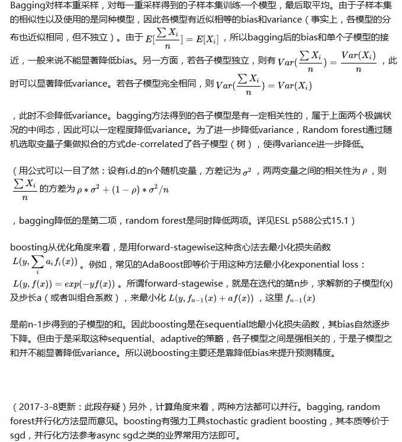

# Q0. 决策树原理

1. 决策树节点分裂时如何选择特征，写出Gini index和Information Gain的公式并举例说明（理论基础）

2. 分类树和回归树的区别是什么？（理论基础）

# Q1. GBDT的原理 （理论基础）

见04_RF_GBDT

# Q2. GBDT与Random Forest作比较，并以此介绍什么是模型的Bias和Variance（理论基础）

1. bagging和boosting区别和联系

2. 介绍方差与偏差

   数学上的解释：

简单直观的答案：

Bagging 是 Bootstrap Aggregating 的简称，意思就是再取样 (Bootstrap) 然后在每个样本上训练出来的模型取平均，所以是降低模型的 variance. Bagging 比如 Random Forest 这种先天并行的算法都有这个效果。

Boosting 则是迭代算法，每一次迭代都根据上一次迭代的预测结果对样本进行加权，所以随着迭代不断进行，误差会越来越小，所以模型的 bias 会不断降低。这种算法无法并行，例子比如 Adaptive Boosting.

# 

# Q3. XGBoost的原理 （理论基础）

1. xgboost相比GBDT的创新之处（**重要**）
2. xgboost 里面的 lambdarank 的损失函数是什么？
3. ~~xgboost 在什么地方做的剪枝，怎么做的？~~
4. xgboost 如何分布式？特征分布式和数据分布式？ 各有什么存在的问题？
5. XGBoost的参数调优有哪些经验（工程能力）
6. XGBoost的正则化是如何实现的（工程能力）
7. lightgbm 和 xgboost 有什么区别？他们的 loss 一样么？ 算法层面有什么区别？