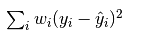
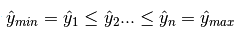
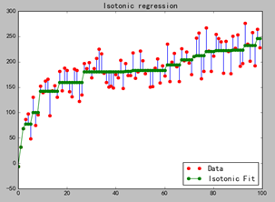

**1.数学定义**

​        保序回归是回归算法的一种,基本思想是：给定一个有限的实数集合,训练一个模型来最小化下列方程：

​        并且满足下列约束条件：

**2.算法过程说明**

​        从该序列的首元素往后观察，一旦出现乱序现象停止该轮观察，从该乱序元素开始逐个吸收元素组成一个序列，直到该序列所有元素的平均值小于或等于下一个待吸收的元素。

​      举例：

原始序列：<9, 10, 14>

结果序列：<9, 10, 14>

​     分析：从9往后观察，到最后的元素14都未发现乱序情况，不用处理。

原始序列：<9, 14, 10>

结果序列：<9, 12, 12>

​     分析：从9往后观察，观察到14时发生乱序（14>10），停止该轮观察转入吸收元素处理，吸收元素10后子序列为<14, 10>，取该序列所有元素的平均值得12，故用序列<12, 12>替代<14, 10>。吸收10后已经到了最后的元素，处理操作完成。

原始序列：<14, 9, 10, 15>

结果序列：<11, 11, 11, 15>

​     分析：从14往后观察，观察到9时发生乱序（14>9），停止该轮观察转入吸收元素处理，吸收元素9后子序列为<14,9>。求该序列所有元素的平均值得12.5，由于12.5大于下个待吸收的元素10，所以再吸收10，得序列<14, 9, 10>。求该序列所有元素的平均值得11，由于11小于下个待吸收的元素15，所以停止吸收操作，用序列<11, 11, 11>替代<14, 9, 10>。

 

**3.举例说明下面实验的原理**

​        以某种药物的使用量为例子：

​        假设药物使用量为数组X=0,1,2,3,4….99，病人对药物的反应量为Y=y1,y2,y3…..y99 ，而由于个体的原因，Y不是一个单调函数(即：存在波动)，如果我们按照药物反应排序，对应的X就会成为乱序，失去了研究的意义。而我们的研究的目的是为了观察随着药物使用量的递增，病人的平均反应状况。在这种情况下，使用保序回归，即不改变X的排列顺序，又求的Y的平均值状况。如下图所示：

​      从图中可以看出，最长的绿线x的取值约是30到60，在这个区间内，Y的平均值一样，那么从经济及病人抗药性等因素考虑，使用药量为30个单位是最理想的。

​      当前IT行业虚拟化比较流行，使用这种方式，找到合适的判断参数，就可以使用此算法使资源得到最大程度的合理利用。