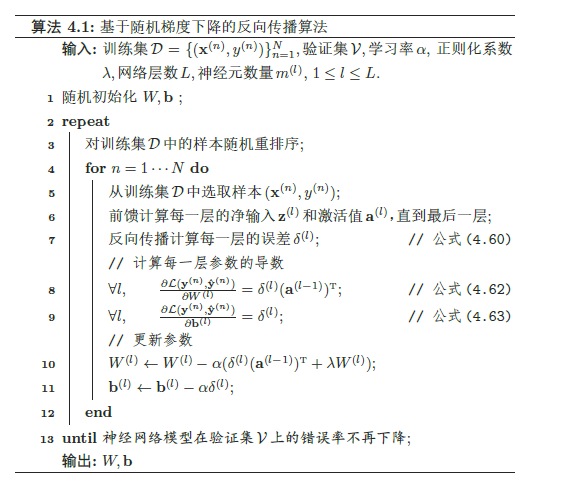
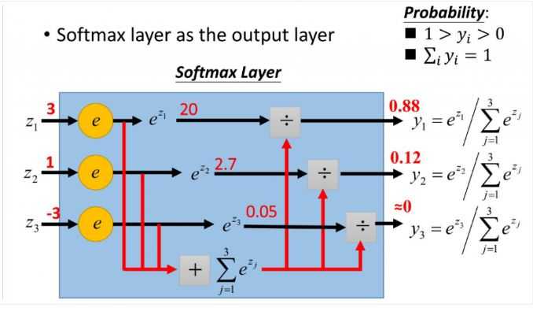

# 1. 神经元

## 1.1 神经元结构

**净输入（Net Input）z** ∈ R表示一个神经元所获得的输入信号x 的加权和

z = wTx + b

净输入z 在经过一个非线性函数f(·) 后，得到神经元的**活性值（Activation）a**

a = f(z)

## 1.2 激活函数

### 1.2.1 Sigmoid 型激活函数

### 1.2.2 修正线性单元

# 2. 前馈神经网络结构

# 3. 反向传播

损失函数对z_l的导数，这个符号的引入很关键。

式4.60是反向传播的迭代计算公式，对于理解梯度消失问题有帮助。

如果熟悉矩阵的导数，BP理解起来就很熟悉

# 4. 自动梯度计算

## 4.1 符号微分和自动微分

区别：符号微分的处理对象是数学表达式，而自动微分的处理对象是一个函数或一段程序；

## 4.2 自动微分

**自动微分**会对复合函数进行一系列分解，构建一个计算图。计算图中的每个非叶子节点表示一个基本操作，每个叶子节点为一个输入变量或常量。

比如如下复合函数及计算图：

图4.8给出了当x = 1,w = 0, b = 0 时复合函数f(x;w, b) 的计算图，其中连边上的红色数字表示前向计算时复合函数中每个变量的实际取值。

## 4.3 静态计算图和动态计算图

计算图的构建可以分为静态计算图和动态计算图。

静态计算图是在编译时构建计算图，计算图构建好之后在程序运行时不能改变，而动态计算图是在程序运行时动态构建。两种构建方式各有优缺点。静态计算图在构建时可以进行优化，并行能力强，但灵活性比较差。动态计算图则不容易优化，当不同输入的网络结构不一致时，难以并行计算，但是灵活性比较高。

在目前深度学习框架里，Theano 和Tensorflow 采用的是静态计算图，而DyNet，Chainer 和PyTorch 采用的是动态计算图。

# 5. 网络优化问题

## 5.1 非凸优化

神经网络的优化问题是一个非凸优化问题。

没有全局最优解，有很多的局部最优解和鞍点。

## 5.2 梯度消失问题

由于Sigmoid 型函数的饱和性，饱和区的导数更是接近于0。这样，误差经过每一层传递都会不断衰减。当网络层数很深时，梯度就会不停的衰减，甚至消失，使得整个网络很难训练。这就是所谓的梯度消失问题（Vanishing Gradient Problem），也称为梯度弥散问题。

# 输出层

## Softmax 函数

**Softmax函数**，或称**归一化指数函数**，是[逻辑函数](https://zh.wikipedia.org/wiki/逻辑函数)的一种推广。它能将一个含任意实数的K维向量 z “压缩”到另一个K维实向量  中，使得每一个元素的范围都在{0，1}之间，并且所有元素的和为1。该函数的形式通常按下面的式子给出：

更形象的映射过程如下图所示：

## 交叉熵损失函数

# 参考文献

邱锡鹏：《神经网络与深度学习》