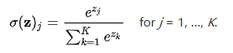

# 1. 反向传播[TODO]

# 2. Softmax 函数

**Softmax函数**，或称**归一化指数函数**，是[逻辑函数](https://zh.wikipedia.org/wiki/逻辑函数)的一种推广。它能将一个含任意实数的K维向量 z “压缩”到另一个K维实向量  中，使得每一个元素的范围都在{0，1}之间，并且所有元素的和为1。该函数的形式通常按下面的式子给出：

更形象的映射过程如下图所示：

# 3. 交叉熵损失函数