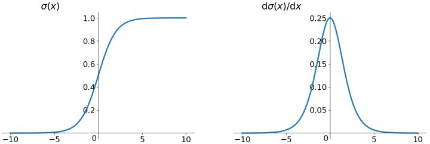

# 1. 激活函数

## 1.1 神经元

## 1.2 激活函数性质

激活函数通常有如下一些性质：

**非线性**： 当激活函数是线性的时候，一个两层的神经网络就可以逼近基本上所有的函数了。但是，如果激活函数是恒等激活函数的时候（即f(x)=x），就不满足这个性质了，而且如果MLP使用的是恒等激活函数，那么其实整个网络跟单层神经网络是等价的。

**可微性**： 当优化方法是基于梯度的时候，这个性质是必须的。

**单调性**： 当激活函数是单调的时候，单层网络能够保证是凸函数。
f(x)≈x： 当激活函数满足这个性质的时候，如果参数的初始化是random的很小的值，那么神经网络的训练将会很高效；如果不满足这个性质，那么就需要很用心的去设置初始值。

**输出值的范围**： 当激活函数输出值是有限 的时候，基于梯度的优化方法会更加稳定，因为特征的表示受有限权值的影响更显著；当激活函数的输出是 无限 的时候，模型的训练会更加高效，不过在这种情况小，一般需要更小的learning rate.

# 2. 激活函数示例

## 2.1 Sigmoid

Sigmoid 函数的一般形式是

这里，参数 aa 控制 Sigmoid 函数的形状，对函数基本性质没有太大的影响。在神经网络中，一般设置 a=1a=1，直接省略。Sigmoid 函数的导数很好求

### 2.1.1 优缺点

特点：可以解释，比如将0-1之间的取值解释成一个神经元的激活率（firing rate）

缺陷：

1. 有饱和区域，是软饱和，在大的正数和负数作为输入的时候，梯度就会变成零，使得神经元基本不能更新。
2. 只有正数输出（不是zero-centered），这就导致所谓的zigzag现象：
3. 计算量大（exp）

### 2.2.2 zero-centered问题

关于第二点的解释及数学推导如下

## 2.2 Tanh

Tanh 激活函数又叫作**双曲正切激活函数（hyperbolic tangent activation function）**。与 Sigmoid 函数类似，Tanh 函数也使用真值，但 Tanh 函数将其压缩至-1 到 1 的区间内。与 Sigmoid 不同，Tanh 函数的输出以零为中心，因为区间在-1 到 1 之间。你可以将 Tanh 函数想象成两个 Sigmoid 函数放在一起。

在实践中，Tanh 函数的使用优先性高于 Sigmoid 函数。负数输入被当作负值，零输入值的映射接近零，正数输入被当作正值。唯一的缺点是：1. Tanh 函数也会有梯度消失的问题，因此在饱和时也会「杀死」梯度。为了解决梯度消失问题，我们来讨论另一个非线性激活函数——修正线性单元（rectified linear unit，ReLU），该函数明显优于前面两个函数，是现在使用最广泛的函数。

## 2.3 ReLU

*ReLU 激活函数*和*ReLU 导数*

从上图可以看到，ReLU 是从底部开始半修正的一种函数。

数学公式为：

当输入 x<0 时，输出为 0，当 x> 0 时，输出为 x。

### 2.3.1 优缺点

优点：

该激活函数使网络更快速地收敛。它不会饱和，即它可以对抗梯度消失问题，至少在正区域（x> 0 时）可以这样，因此神经元至少在一半区域中不会把所有零进行反向传播。由于使用了简单的阈值化（thresholding），ReLU 计算效率很高。

但是 ReLU 神经元也存在一些缺点：

1. 不以零为中心：和 Sigmoid 激活函数类似，ReLU 函数的输出不以零为中心。
2. 前向传导（forward pass）过程中，如果 x < 0，则神经元保持非激活状态，且在后向传导（backward pass）中「杀死」梯度。这样权重无法得到更新，网络无法学习。当 x = 0 时，该点的梯度未定义，但是这个问题在实现中得到了解决，通过采用左侧或右侧的梯度的方式。

### 2.3.2 Dead ReLU问题

假设有一个神经网络的输入W遵循某种分布，对于一组固定的参数（样本），w的分布也就是ReLU的输入的分布。假设ReLU输入是一个低方差中心在+0.1的高斯分布。

在这个场景下：

- 大多数ReLU的输入是正数，因此
- 大多数输入经过ReLU函数能得到一个正值（ReLU is open），因此
- 大多数输入能够反向传播通过ReLU得到一个梯度，因此
- ReLU的输入（w）一般都能得到更新通过随机反向传播（SGD）

现在，假设在随机反向传播的过程中，**有一个巨大的梯度经过ReLU，由于ReLU是打开的，将会有一个巨大的梯度传给输入（w）。这会引起输入w巨大的变化，也就是说输入w的分布会发生变化**，假设输入w的分布现在变成了一个低方差的，中心在-0.1高斯分布。

在这个场景下：

- 大多数ReLU的输入是负数，因此
- 大多数输入经过ReLU函数能得到一个0（**ReLU is close**）,因此
- 大多数输入不能反向传播通过ReLU得到一个梯度，因此
- ReLU的**输入w一般都得不到更新**，通过随机反向传播（SGD）

发生了什么？只是ReLU函数的输入的分布函数发生了很小的改变（-0.2的改变），导致了ReLU函数行为质的改变。我们越过了0这个边界，ReLU函数几乎永久的关闭了。更重要的是ReLU函数一旦关闭，参数w就得不到更新，这就是所谓的‘dying ReLU’。

### 2.3.3 使用 ReLu 激活函数的优点

1. sigmoid 函数需要进行浮点四则运算，在实践中，使用 ReLu 激活函数神经网络通常会比使用 sigmoid 或者 tanh 激活函数学习的更快。
2. sigmoid 和 tanh 函数的导数在正负饱和区的梯度都会接近于 0，这会造成梯度弥散，而 Relu 和Leaky ReLu 函数大于 0 部分都为常数，不会产生梯度弥散现象。
3. 需注意，Relu 进入负半区的时候，梯度为 0，神经元此时不会训练，产生所谓的稀疏性，而 Leaky ReLu 不会产生这个问题。