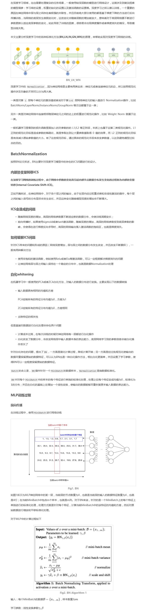
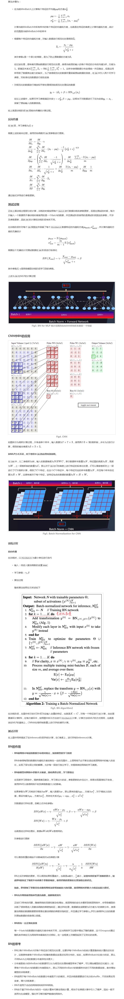

# 规范化

规范化的含义

为什么要规范化

规范化有哪些类型

# 批规范化（Batch Normalization）

参考

[http://xiaofengshi.com/2019/03/06/%E6%B7%B1%E5%BA%A6%E5%AD%A6%E4%B9%A0-Normalization/](http://xiaofengshi.com/2019/03/06/深度学习-Normalization/)