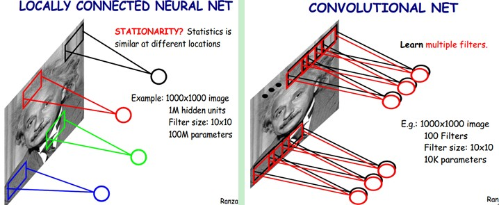

# 1. 卷积神经网络的组成层

在卷积神经网络中，一般包含5种类型的层：

> - 输入层
> - 卷积运算层
> - 激活函数层
> - 池化层
> - 全连接层

**输入层**主要包含对原始图像进行预处理，包括白化、归一化、去均值等等。

**卷积运算层**主要使用滤波器，通过设定步长、深度等参数，对输入进行不同层次的特征提取。滤波器中的参数可以通过反向传播算法进行学习。

**激活函数层**主要是将卷积层的输出做一个非线性映射。常见的激活函数包括sigmoid,tanh,Relu等。

**池化层**主要是用于参数量压缩。可以减轻过拟合情况。常见的有平均池化和最大值池化，不包含需要学习的参数。

**全连接层**主要是指两层网络，所有神经元之间都有权重连接。常见用于网络的最后一层，用于计算类别得分。


# 2. Layers

## 2.1 CONV Layer 

### The brain/neuron view of CONV Layer


### 卷积层参数的数量


## 2.2 Pooling layer


​		在构建卷积神经网络时，经常会使用池化操作，而池化层往往在卷积层后面，通过**池化操作来降低卷积层输出的特征维度，同时可以防止过拟合现象。**池化操作可以降低图像维度的原因，本质上是因为图像具有一种“静态性”的属性，这个意思是说在一个图像区域有用的特征极有可能在另一个区域同样有用。因此，为了描述一个大的图像，很直观的想法就是对不同位置的特征进行聚合统计。例如，可以计算图像在固定区域上特征的平均值 (或最大值)来代表这个区域的特征。[1]

​		池化操作过程如图所示，对固定区域的特征，使用某一个值来表示。最常见的池化操作有两种，分为平均池化mean pooling和最大池化max pooling

1、平均池化：计算图像区域的平均值作为该区域池化后的值。

2、最大池化：选图像区域的最大值作为该区域池化后的值。

上述的池化过程，相邻的池化窗口间没有重叠部分。


## 2.3 Fully Connected Layer


# 3. 卷积层中的几个基本参数？

在卷积层中，有一些我们常用的参数，定义如下

## 5.3.1 卷积核大小

英文名是Kernel Size:卷积核的大小定义了卷积的感受野。二维卷积的核大小选择通常是3，即3×3。

## 5.3.2 卷积核的步长

英文名是Stride: Stride定义了卷积核在卷积过程中的步长。虽然它的默认值通常为1，但我们可以将步长设置为2，可以实现类似于pooling的下采样功能。

## 5.3.3 边缘填充

英文名是Padding: Padding用于填充输入图像的边界。一个(半)填充的卷积将使空间输出维度与输入相等，而如果卷积核大于1，则对于未被填充的图像，卷积后将会使图像一些边界消失。

## 5.3.4 输入和输出通道

英文名是 Input/Output Channels 一个卷积层接受一定数量的输入通道I，并计算一个特定数量的输出通道O，这一层所需的参数可以由I*O*K计算，K等于卷积核中参数的数量。


# 重要概念

## 局部连接

我们首先了解一个概念，**感受野，即每个神经元仅与输入神经元相连接的一块区域**。
在图像卷积操作中，神经元在空间维度上是局部连接，但在深度上是全连接。局部连接的思想，是受启发于生物学里的视觉系统结构，视觉皮层的神经元就是仅用局部接受信息。对于二维图像，局部像素关联性较强。这种局部连接保证了训练后的滤波器能够对局部特征有最强的响应，使神经网络可以提取数据的局部特征；
下图是一个很经典的图示，左边是全连接，右边是局部连接。


对于一个1000 × 1000的输入图像而言，如果下一个隐藏层的神经元数目为10^6个，采用全连接则有1000 × 1000 × 10^6 = 10^12个权值参数，如此巨大的参数量几乎难以训练；而采用局部连接，隐藏层的每个神经元仅与图像中10 × 10的局部图像相连接，那么此时的权值参数数量为10 × 10 × 10^6 = 10^8，将直接减少4个数量级。

## 权值共享

权值共享，即计算**同一深度的神经元**时采用的**卷积核参数**是共享的。权值共享在一定程度上讲是有意义的，是由于在神经网络中，提取的底层边缘特征与其在图中的位置无关。但是在另一些场景中是无意的，如在人脸识别任务，我们期望在不同的位置学到不同的特征。
需要注意的是，权重只是对于同一深度切片的神经元是共享的。在卷积层中，通常采用多组卷积核提取不同的特征，即对应的是不同深度切片的特征，而不同深度切片的神经元权重是不共享。相反，偏置这一权值对于同一深度切片的所有神经元都是共享的。
权值共享带来的好处是大大降低了网络的训练难度。如下图，假设在局部连接中隐藏层的每一个神经元连接的是一个10 × 10的局部图像，因此有10 × 10个权值参数，将这10 × 10个权值参数共享给剩下的神经元，也就是说隐藏层中10^6个神经元的权值参数相同，那么此时不管隐藏层神经元的数目是多少，需要训练的参数就是这 10 × 10个权值参数（也就是卷积核的大小）。



这里就体现了卷积神经网络的奇妙之处，使用少量的参数，却依然能有非常出色的性能。上述仅仅是提取图像一种特征的过程。如果要多提取出一些特征，可以增加多个卷积核，**不同的卷积核能够得到图像不同尺度下的特征**，称之为特征图（feature map）。


# keras示例

```python
model = Sequential()
model.add(Conv2D(32, (3, 3), padding='same',
                 input_shape=x_train.shape[1:]))
model.add(Activation('relu'))
model.add(Conv2D(32, (3, 3)))
model.add(Activation('relu'))
model.add(MaxPooling2D(pool_size=(2, 2)))
model.add(Dropout(0.25))

model.add(Conv2D(64, (3, 3), padding='same'))
model.add(Activation('relu'))
model.add(Conv2D(64, (3, 3)))
model.add(Activation('relu'))
model.add(MaxPooling2D(pool_size=(2, 2)))
model.add(Dropout(0.25))

model.add(Flatten())
model.add(Dense(512))
model.add(Activation('relu'))
model.add(Dropout(0.5))
model.add(Dense(num_classes))
model.add(Activation('softmax'))

# initiate RMSprop optimizer
opt = keras.optimizers.rmsprop(lr=0.0001, decay=1e-6)

# Let's train the model using RMSprop
model.compile(loss='categorical_crossentropy',
              optimizer=opt,
              metrics=['accuracy'])
```


# 问题

## 1、说一下你理解的卷积核， 1x1的卷积核有什么作用？【TODO】

1×1的卷积主要有以下两个方面的作用：

- 实现信息的跨通道交互和整合。
- 对卷积核通道数进行降维和升维，减小参数量。


## 2、讲一下pooling的作用， 为什么max pooling要更常用？哪些情况下，average pooling比max pooling更合适？

max-pooling的效果更好，虽然max-pooling和average-pooling都对数据做了下采样，但是max-pooling感觉更像是做了特征选择，选出了分类辨识度更好的特征，提供了非线性，根据相关理论，特征提取的误差主要来自两个方面：（1）邻域大小受限造成的估计值方差增大；（2）卷积层参数误差造成估计均值的偏移。一般来说，average-pooling能减小第一种误差，更多的保留图像的背景信息，max-pooling能减小第二种误差，更多的保留纹理信息。average-pooling更强调对整体特征信息进行一层下采样，在减少参数维度的贡献上更大一点，更多的体现在信息的完整传递这个维度上，在一个很大很有代表性的模型中，比如说DenseNet中的模块之间的连接大多采用average-pooling，在减少维度的同时，更有利信息传递到下一个模块进行特征提取。

最大池化避免平均池化的模糊化问题，重叠提升了特征的丰富性。

## 3、讲一下AlexNet的具体结构，每层的作用

