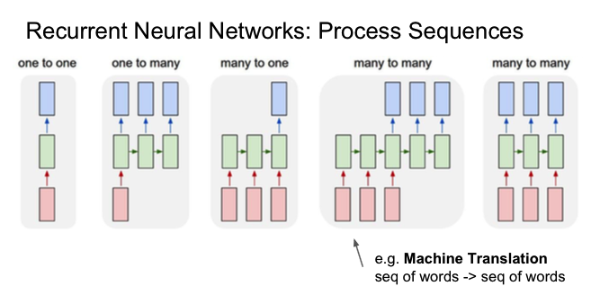
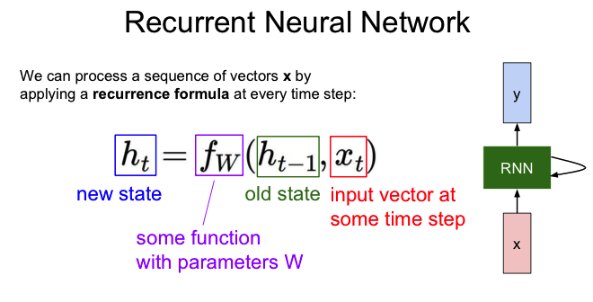
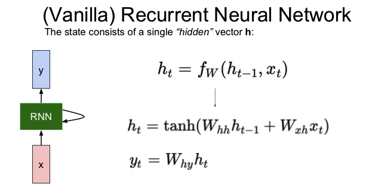
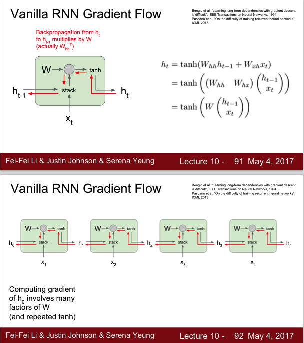
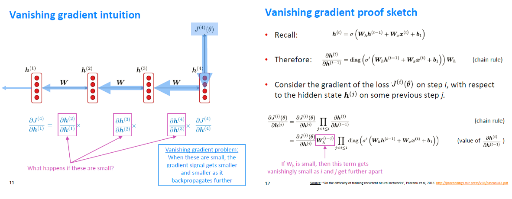
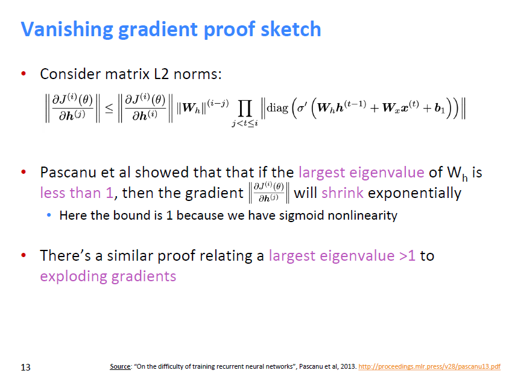

## 1、RNN根据任务类型去划分有

**one to one(Vanilla RNN)**

**one to many:** 

e.g. Image Captioning, image->sequence of words

**many to one**

e.g. Sentiment Classification, sequence of words->sentiment

**many to many**

e.g. Machine Translation, seq of words -> seq of words

e.g. Vedio Classification on frame level

## 2、vanilla rnn 计算公式

## 3、Vanilla RNN Gradient Flow

如下图展示了RNN的梯度计算过程，如果计算h0，那么会有多次与W的乘积；

这样会产生两个问题：**梯度爆炸**和**梯度消失**

梯度爆炸的解决办法是做**梯度截断**，梯度消失的解决办法是改变RNN的网络结构；

## 4、Vanishing Gradients

RNNs的反向传播(参考CS224N，cs224n-2019-lecture07-fancy-rnn)

有相关证明，当Wh矩阵的最大特征值小于1时，是梯度消失情况

当Wh矩阵的最大特征值大于1时，是梯度爆炸情况

## **Next time** 

- Problems with RNNs! • Vanishing gradients 

  **motivates** 

- Fancy RNN variants! 

  • LSTM 
  • GRU
  • multi-layer
  • bidirectional 

## 参考文献

1、cs231n_2017_lecture10 Recurrent Neural Networks

2、cs224n-2019-lecture06-rnnlm