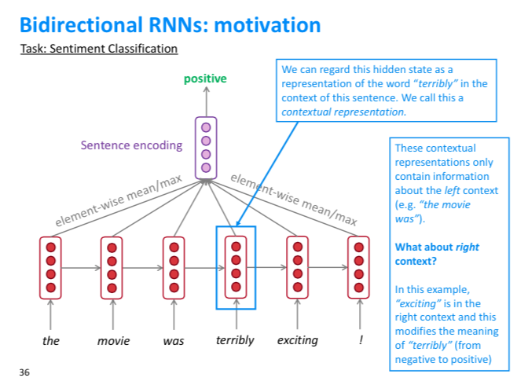
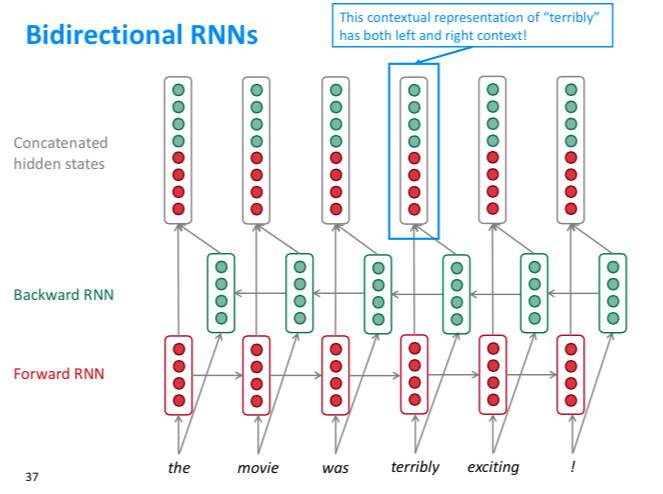
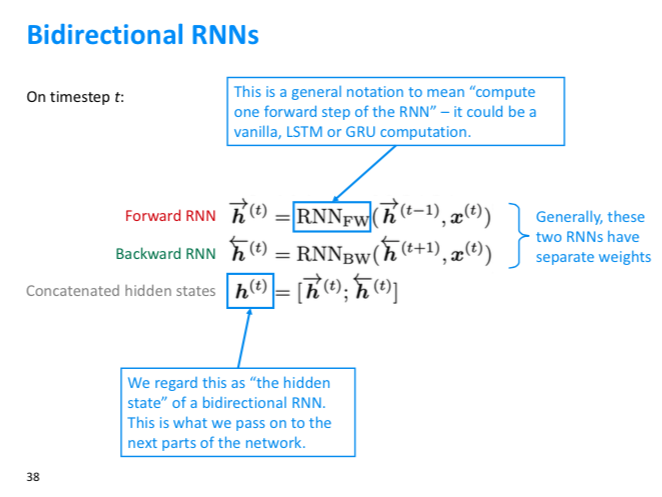

**Vanishing gradient problem** 

**Long Short-Term Memory (LSTM)**

**Gated Recurrent Units (GRU)**

**Is vanishing/exploding gradient just a RNN problem?**

**Bidirectional RNNs**

**Multi-layer RNNs**

#  LSTM

Long Short Term Memory

超生动图解LSTM和GRU：拯救循环神经网络的记忆障碍，就靠它们了

https://zhuanlan.zhihu.com/p/46981722

# GRU

# Bidirectional RNNs
我们以单向的RNN举例，在NLP任务中比如情感分析中，terribly单词对应LSTM单元的隐藏状态认为是单词的contextual表示，但是单向RNN中，terribly的contextual表示只和它的上文相关，和下文无关，这是不合逻辑的。

如何该单词的contextual表示考虑到下文呢，就需要一个反向的RNN。

如下是双向RNN的结构

该结构中正向和反向的RNN没有相互影响，在输出层的每个时间步，把正向和反向的隐藏状态拼接

Bidirectional RNNs的形式化

# Multi-layer RNNs

NEXT

# 参考

1、超生动图解LSTM和GRU：拯救循环神经网络的记忆障碍，就靠它们了

https://zhuanlan.zhihu.com/p/46981722

