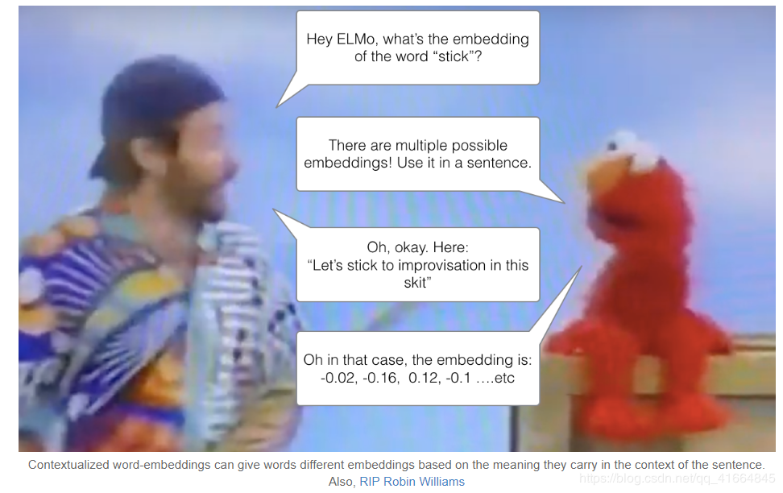
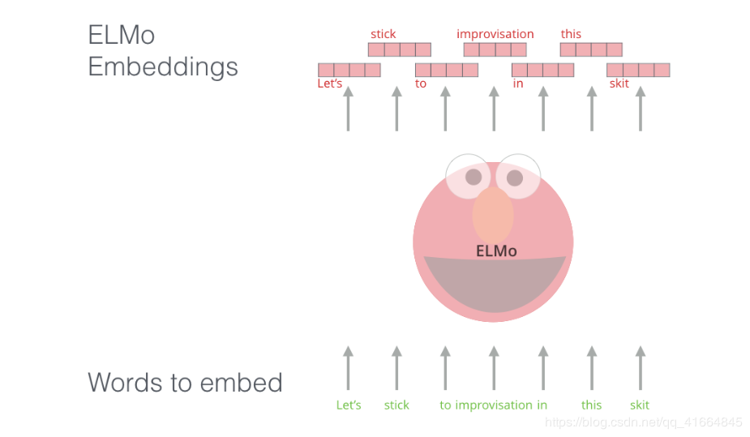
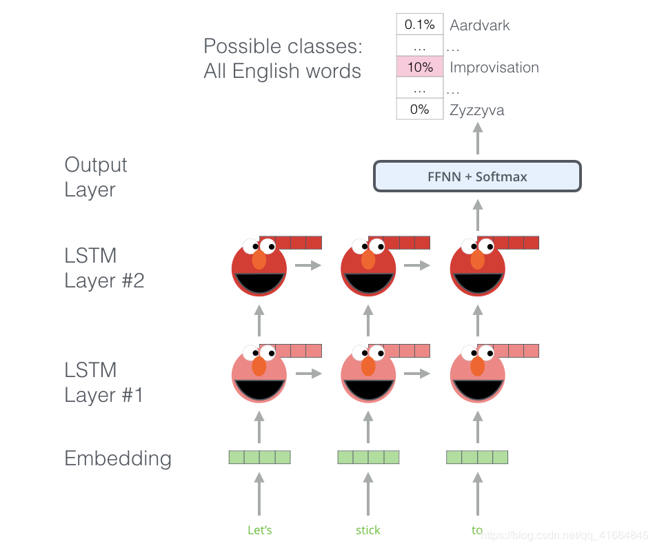
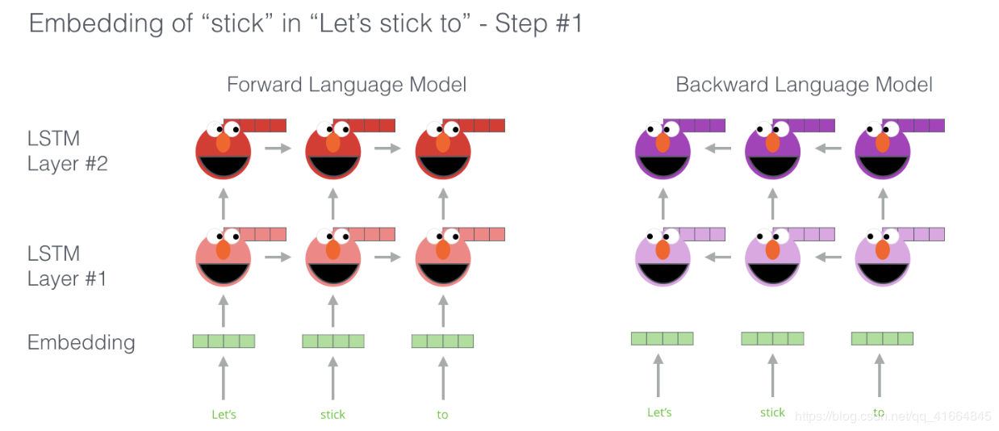
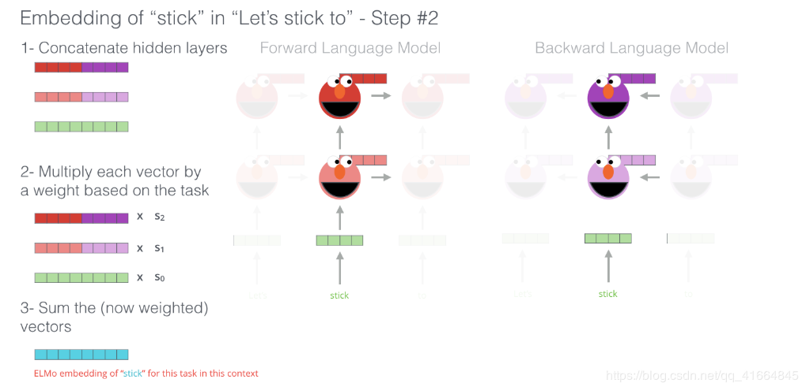

​	词嵌入方式有一个很明显的问题，因为使用预训练好的词向量模型，那么无论上下文的语境关系如何，每个单词都只有一个唯一的且已经固定保存的向量化形式“。Wait a minute “ - 出自(Peters et. al., 2017, McCann et. al., 2017, and yet again Peters et. al., 2018 in the ELMo paper )

“ Wait a minute ”这是一个欧美日常梗，示例：

                         我：兄弟，你认真学习深度，没准能拿80W年薪啊。
                         你：Wait a minute，这么好，你为啥不做。 

 这和中文的同音字其实也类似，用这个举一个例子吧， '长' 这个字，在 '长度' 这个词中表示度量，在 '长高' 这个词中表示增加。那么为什么我们不通过”长'周围是度或者是高来判断它的读音或者它的语义呢？嗖嘎，这个问题就派生出语境化的词嵌入模型。

EMLo改变Word2vec类的将单词固定为指定长度的向量的处理方式，它是在为每个单词分配词向量之前先查看整个句子，然后使用bi-LSTM来训练它对应的词向量。

     ELMo为解决NLP的语境问题作出了重要的贡献，它的LSTM可以使用与我们任务相关的大量文本数据来进行训练，然后将训练好的模型用作其他NLP任务的词向量的基准。
    
     ELMo的秘密是什么？
    
    ELMo会训练一个模型，这个模型接受一个句子或者单词的输入,输出最有可能出现在后面的一个单词。想想输入法，对啦，就是这样的道理。这个在NLP中我们也称作Language Modeling。这样的模型很容易实现，因为我们拥有大量的文本数据且我们可以在不需要标签的情况下去学习。

上图介绍了ELMo预训练的过程的步骤的一部分：

我们需要完成一个这样的任务：输入“Lets stick to”，预测下一个最可能出现的单词，如果在训练阶段使用大量的数据集进行训练，那么在预测阶段我们可能准确的预测出我们期待的下一个单词。比如输入“机器”，在‘’学习‘和‘买菜’中它最有可能的输出会是‘学习’而不是‘买菜’。

从上图可以发现，每个展开的LSTM都在最后一步完成预测。

对了真正的ELMo会更进一步，它不仅能判断下一个词，还能预测前一个词。（Bi-Lstm）

ELMo通过下图的方式将hidden states（的初始的嵌入）组合咋子一起来提炼出具有语境意义的词嵌入方式（全连接后加权求和）

---------------------
作者：adam-liu 
来源：CSDN 
原文：https://blog.csdn.net/qq_41664845/article/details/84787969 
版权声明：本文为博主原创文章，转载请附上博文链接！