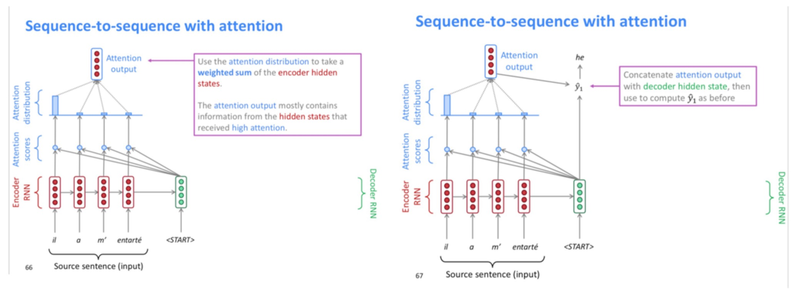
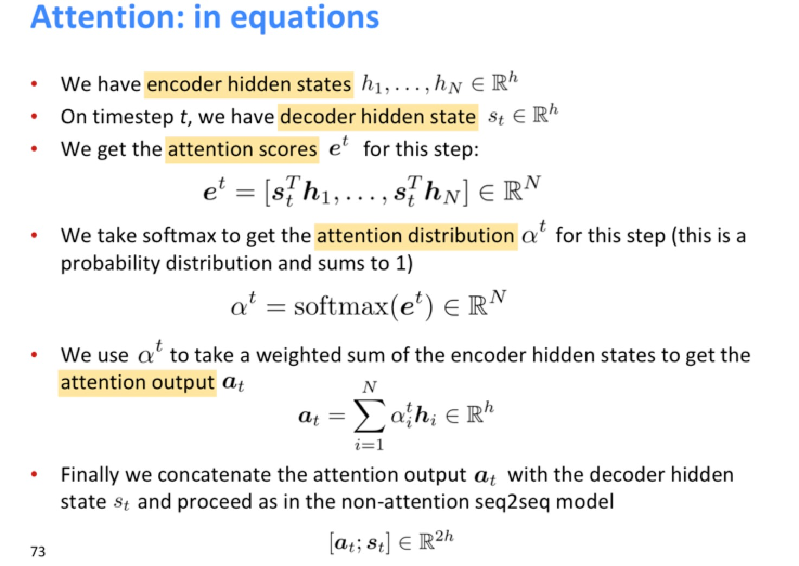
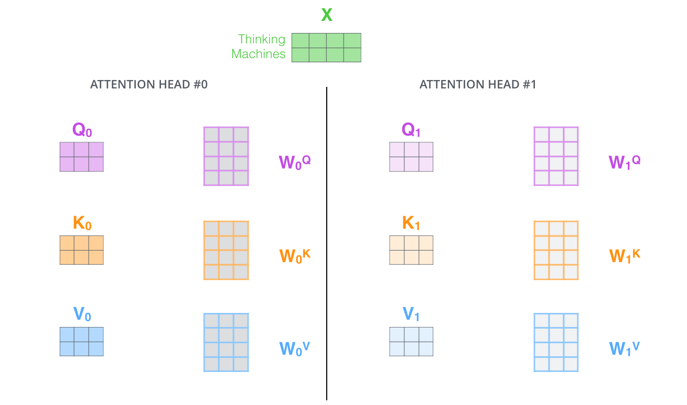

# ANN的Attention 

[TOC]

## 1. Attention解决的问题

​       当用神经网络来处理大量的输入信息时，也可以借鉴人脑的注意力机制，只选择一些关键的信息输入进行处理，来提高神经网络的效率

### 1.1 RNN结构的局限

​		以NMT任务举例，NMT一般采用Encoder-Decoder架构，即encoder读取输入的句子将其转换为定长的一个向量，然后decoder再将这个向量翻译成对应的目标语言的文字。通常encoder及decoder均采用RNN结构，如LSTM或GRU等。但存在的问题是，RNN的结构有存储容量和长程依赖问题，存储到的定长的向量很难保证存储了所有的信息。

### 1.2 Attention机制的引入

​		Attention机制跟人类翻译文章时候的思路有些类似，即将注意力关注于我们翻译部分对应的上下文。同样的，Attention模型中，当我们翻译当前词语时，我们会寻找源语句中相对应的几个词语，并结合之前的已经翻译的部分作出相应的翻译，如下图所示，当我们翻译“knowledge”时，只需将注意力放在源句中“知识”的部分，当翻译“power”时，只需将注意力集中在"力量“。这样，当我们decoder预测目标翻译的时候就可以看到encoder的所有信息，而不仅局限于原来模型中定长的隐藏向量，并且不会丧失长程的信息。

## 2. Attention机制

参考《nndl-book-邱锡鹏》- 8.1.2 人工神经网络中的注意力机制

### 2.1 注意力机制的计算

可以分为两步：一是在所有输入信息上计算注意力分布，二是根据注意力分布来计算输入信息的加权平均。

#### 2.1.1 注意力分布

#### 2.1.2 注意力打分函数

#### 2.1.3 加权平均

### 2.2 键值对注意力

### 2.3 多头注意力

=======================================================================================

## 3. Attention的应用

### 3.1 在seq2seq模型应用attention

内容来源于cs224n公开课

Attention model和seq2seq模型紧密联系的

Attention解决了基于encoder-decoder结构下seq2seq模型的信息瓶颈问题。

Attention的核心思想是在decoder的每个时间步，选择与encoder直接连接的方式，专注于source序列相应的部分。

如下图所示

1、在decoder里面每个单元的输出前，计算该单元hidden status与encoder各个单元的hidden status计算点积，获得attention分数

2、然后softmax归一化处理获得attention分布

3、attention分布作为权重对encoder中各个单元hidden status求加权和

4、把decoder该单元的attention输出与hidden status，计算输出

### 3.2 attention的优缺点

优点是：

- Attention significantly improves NMT performance

It’s very useful to allow decoder to focus on certain parts of the source

- Attention solves the bottleneck problem

Attention allows decoder to look directly at source; bypass bottleneck

- Attention helps with vanishing gradient problem 
- Attention provides some interpretability 

但是缺点是：

1、Attention不能并行化；

2、Attention忽略了输入句子、目标句子之间的关系；

## 4. Self-Attention

### **4.1 Self-Attention at a High Level**

​		作为我们想要翻译的输入语句“The animal didn’t cross the street because it was too tired”。句子中"it"指的是什么呢？“it"指的是"street” 还是“animal”？对人来说很简单的问题，但是对算法而言并不简单。
​		当模型处理单词“it”时，self-attention允许将“it”和“animal”联系起来。当模型处理每个位置的词时，self-attention允许模型看到句子的其他位置信息作辅助线索来更好地编码当前词。如果你对RNN熟悉，就能想到RNN的隐状态是如何允许之前的词向量来解释合成当前词的解释向量。Transformer使用self-attention来将相关词的理解编码到当前词中。

### **4.2 Self-Attention in Detail**

我们先看下如何计算self-attention的向量，再看下如何以矩阵方式计算。

#### 4.2.1 self-attention向量的计算

**第一步**，根据编码器的输入向量，生成三个向量，比如，对每个词向量，生成query-vec, key-vec, value-vec，生成方法为分别乘以三个矩阵，这些矩阵在训练过程中需要学习。【注意：不是每个词向量独享3个matrix，而是所有输入共享3个转换矩阵；**权重矩阵是基于输入位置的转换矩阵**；有个可以尝试的点，如果每个词独享一个转换矩阵，会不会效果更厉害呢？】
注意到这些新向量的维度比输入词向量的维度要小（512–>64），并不是必须要小的，是为了让多头attention的计算更稳定。

输入乘以W^q得到query

所谓的query/key/value-vec是什么？
这种提取对计算和思考attention是有益的，当读完下面attention是如何计算的之后，你将对这些向量的角色有更清晰的了解。
**第二步**，计算attention就是计算一个分值。对“Thinking Matchines”这句话，对“Thinking”（pos#1）计算attention 分值。我们需要计算每个词与“Thinking”的评估分，这个分决定着编码“Thinking”时（某个固定位置时），每个输入词需要集中多少关注度。
这个分，通过“Thing”对应query-vector与所有词的key-vec依次做点积得到。所以当我们处理位置#1时，第一个分值是q1和k1的点积，第二个分值是q1和k2的点积。

**第三步和第四步**，除以8（=dimkey‾‾‾‾‾‾√=\sqrt{dim_{key}}=*d**i**m**k**e**y*），这样梯度会更稳定。然后加上softmax操作，归一化分值使得全为正数且加和为1。

softmax分值决定着在这个位置，每个词的表达程度（关注度）。很明显，这个位置的词应该有最高的归一化分数，但大部分时候总是有助于关注该词的相关的词。
**第五步**，将softmax分值与value-vec按位相乘。保留关注词的value值，削弱非相关词的value值。
**第六步**，将所有加权向量加和，产生该位置的self-attention的输出结果。

上述就是self-attention的计算过程，生成的向量流入前向网络。在实际应用中，上述计算是以速度更快的矩阵形式进行的。下面我们看下在单词级别的矩阵计算。

#### **4.2.2 Self-Attention矩阵形式的计算**

**第一步**，计算query/key/value matrix，将所有输入词向量合并成输入矩阵XX*X*，并且将其分别乘以权重矩阵Wq,Wk,WvW^q, W^k, W^v*W**q*,*W**k*,*W**v*。

输入矩阵X的每一行表示输入句子的一个词向量

**最后**，鉴于我们使用矩阵处理，将步骤2~6合并成一个计算self-attention层输出的公式。

矩阵形式的self-attention计算

### 4.3 multi-headed机制的self-attention

论文进一步增加了multi-headed的机制到self-attention上，在如下两个方面提高了attention层的效果：

1. 多头机制扩展了模型集中于不同位置的能力。在上面的例子中，z1只包含了其他词的很少信息，仅由实际自己词决定。在其他情况下，比如翻译 “The animal didn’t cross the street because it was too tired”时，我们想知道单词"it"指的是什么。
2. 多头机制赋予attention多种子表达方式。像下面的例子所示，在多头下有多组query/key/value-matrix，而非仅仅一组（论文中使用8-heads）。每一组都是随机初始化，经过训练之后，输入向量可以被映射到不同的子表达空间中。

每个head都有一组Q/K/V matrix

如果我们计算multi-headed self-attention的，分别有八组不同的Q/K/V matrix，我们得到八个不同的矩阵。

这会带来点麻烦，前向网络并不能接收八个矩阵，而是希望输入是一个矩阵，所以要有种方式处理下八个矩阵合并成一个矩阵。

上述就是多头自注意机制的内容，我认为还仅是一部分矩阵，下面尝试着将它们放到一个图上可视化如下。

现在加入attention heads之后，重新看下当编码“it”时，哪些attention head会被集中。

编码"it"时，一个attention head集中于"the animal"，另一个head集中于“tired”，某种意义上讲，模型对“it”的表达合成了的“animal”和“tired”两者

如果我们将所有的attention heads都放入到图中，就很难直观地解释了。

## 5. Transformer

参考05_Transformer