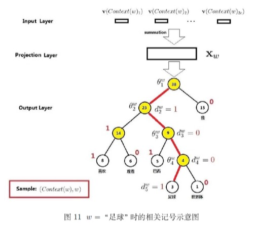
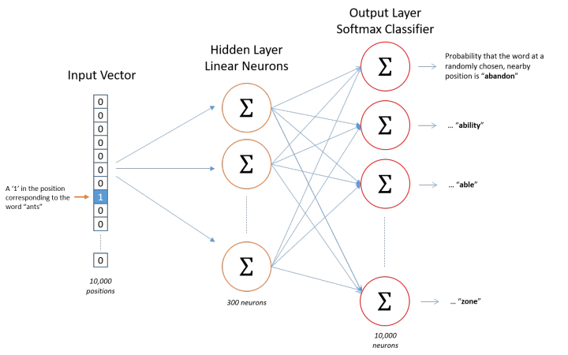

## #3 背景知识

3.1 统计语言模型

3.2 n-gram模型

3.3 神经概率语言模型，NNLM

3.4 词向量的理解

​	Word2Vec是从大量文本语料中以无监督的方式学习语义知识的一种模型，它被大量地用在自然语言处理（NLP）中。那么它是如何帮助我们做自然语言处理呢？**Word2Vec其实就是通过学习文本来用词向量的方式表征词的语义信息，即通过一个嵌入空间使得语义上相似的单词在该空间内距离很近。**Embedding其实就是一个映射，将单词从原先所属的空间映射到新的多维空间中，也就是把原先词所在空间嵌入到一个新的空间中去。

## \#4 基于hierarchical softmax的模型

理解CBOW/Skip-gram模型，网络结构示意图

层次softmax与负采样的两种实现框架

目标函数

### 4.1 CBOW模型

#### 4.1.1 网络结构

与NNLM模型的不同：

- 从输入层到投影层的映射，NNLM是通过拼接，CBOW是通过累加求和

- NNLM有隐藏层，CBOW没有

- 输出层NNLM是线性结构，CBOW是树形结构

#### 4.1.2 梯度计算

1. 相关记号及示意图

2. 条件概率p(w|Context(w))，视为一系列二分类问题

3. 目标函数及对数似然函数表达式

4. 梯度计算，对theta，对xw，然后链式法则传递给v(w')，其中w' in Context(w)

5. 伪代码

#### **问题1、层次softmax相比于NNLM，解决了什么问题，怎样解决的？**

层次softmax提升了性能

NNLM需要矩阵的乘法，softmax归一化计算，复杂度至少是O(N)

层次softmax只需要计算从树的根节点到叶节点，复杂度应该是O(logN)

### ~~4.2 Skip-gram模型~~

#### ~~4.2.1 网络结构~~

#### ~~4.2.2 梯度计算~~

- 条件概率

- 对数似然函数

- 梯度计算与更新

  

## \#5 基于Negative Sampling的模型

Word2Vec的作者在它的第二篇论文中的三个创新：

1. 将常见的单词组合（word pairs）或者词组作为单个“words”来处理。
2. 对高频次单词进行抽样来减少训练样本的个数。
3. 对优化目标采用“negative sampling”方法，这样每个训练样本的训练只会更新一小部分的模型权重，从而降低计算负担，还提高了训练的词向量的质量。

### 5.1 基于Skip-gram模型的负采样

参考知乎：https://zhuanlan.zhihu.com/p/27234078

假设拥有10000个单词的词汇表，我们如果想嵌入300维的词向量，那么我们的**输入-隐层权重矩阵**和**隐层-输出层的权重矩阵**都会有 10000 x 300 = 300万个权重，在如此庞大的神经网络中进行梯度下降是相当慢的。更糟糕的是，你需要大量的训练数据来调整这些权重并且避免过拟合。百万数量级的权重矩阵和亿万数量级的训练样本意味着训练这个模型将会是个灾难。

vocabulary的大小决定了我们的Skip-Gram神经网络将会拥有大规模的权重矩阵，所有的这些权重需要通过我们数以亿计的训练样本来进行调整，这是非常消耗计算资源的，并且实际中训练起来会非常慢。

**负采样（negative sampling）**解决了这个问题，它是用来提高训练速度并且改善所得到词向量的质量的一种方法。不同于原本每个训练样本更新所有的权重，负采样每次让一个训练样本仅仅更新一小部分的权重，这样就会降低梯度下降过程中的计算量。

当我们用训练样本 ( input word: "fox"，output word: "quick") 来训练我们的神经网络时，“ fox”和“quick”都是经过one-hot编码的。如果我们的vocabulary大小为10000时，在输出层，我们期望对应“quick”单词的那个神经元结点输出1，其余9999个都应该输出0。在这里，这9999个我们期望输出为0的神经元结点所对应的单词我们称为“negative” word。

当使用负采样时，我们将随机选择一小部分的negative words（比如选5个negative words）来更新对应的权重。我们也会对我们的“positive” word进行权重更新（在我们上面的例子中，这个单词指的是”quick“）。

我们的隐层-输出层拥有300 x 10000的权重矩阵。如果使用了负采样的方法我们仅仅去更新我们的positive word-“quick”的和我们选择的其他5个negative words的结点对应的权重，共计6个输出神经元，相当于每次只更新300*6=1800个权重。对于3百万的权重来说，相当于只计算了0.06%的权重，这样计算效率就大幅度提高。

从上图去直观类比！

### 5.2 Skip-gram模型

1. 示例

   

2. 样本的条件概率

3. 目标函数

4. 梯度计算

5. 伪代码

### 5.3 负采样算法

一个单词被选作negative sample的概率跟它出现的频次有关，出现频次越高的单词越容易被选作negative words。

在word2vec的C语言实现中，你可以看到对于这个概率的实现公式。每个单词被选为“negative words”的概率计算公式与其出现的频次有关。

代码中的公式实现如下：

每个单词被赋予一个权重，即， 它代表着单词出现的频次。

## # 问题

### 问题1、业界主要采用的方案

主要用skip-gram加上negative sampling这一套

### 问题2、CBOW vs Skip-gram

skip-gram学习的词向量更细致，但语料库中有大量低频词时，使用skip-gram学习比较合适;

在skip-gram当中，每个词都要收到周围的词的影响，每个词在作为中心词的时候，都要进行K次的预测、调整。因此， 当数据量较少，或者词为生僻词出现次数较少时， 这种多次的调整会使得词向量相对的更加准确。

cbow从另外一个角度来说，某个词也是会受到多次周围词的影响（多次将其包含在内的窗口移动），进行词向量的跳帧，但是他的调整是跟周围的词一起调整的，grad的值会平均分到该词上， 相当于该生僻词没有收到专门的训练，它只是沾了周围词的光而已。

https://stackoverflow.com/questions/38287772/cbow-v-s-skip-gram-why-invert-context-and-target-words

As we know, **CBOW** is learning to predict the word by the context. Or maximize the probability of the target word by looking at the context. And this happens to be a problem for rare words. For example, given the context `yesterday was a really [...] day` CBOW model will tell you that most probably the word is `beautiful` or `nice`. Words like `delightful` will get much less attention of the model, because it is designed to predict the most probable word. This word will be smoothed over a lot of examples with more frequent words.

On the other hand, the **skip-gram** model is designed to predict the context. Given the word `delightful` it must understand it and tell us that there is a huge probability that the context is `yesterday was really [...] day`, or some other relevant context. With **skip-gram** the word `delightful` will not try to compete with the word `beautiful` but instead, `delightful+context`pairs will be treated as new observations.

**According to Mikolov**

**Skip-gram:** works well with small amount of the training data, represents well even rare words or phrases.

**CBOW:** several times faster to train than the skip-gram, slightly better accuracy for the frequent words

### 问题3、层次softmax vs 负采样

与层次softmax相比，NEG不使用复杂的霍夫曼树，而是利用简单的随机负采样，大幅度提高性能，是层次softmax的一种替代。

## 参考：

https://zhuanlan.zhihu.com/p/27234078

http://mccormickml.com/2016/04/19/word2vec-tutorial-the-skip-gram-model/