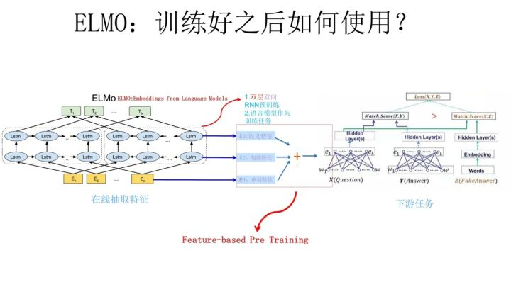

1/NNLM

神经网络语言模型

2/word2vec

QA举例

一词多义问题

3/ELMO

从Word Embedding到ELMO

\- Embedding from Language Models

​	ELMO的本质思想是：我事先用语言模型学好一个单词的Word Embedding，此时多义词无法区分，不过这没关系。在我实际使用Word Embedding的时候，单词已经具备了特定的上下文了，这个时候我可以根据上下文单词的语义去调整单词的Word Embedding表示，这样经过调整后的Word Embedding更能表达在这个上下文中的具体含义，自然也就解决了多义词的问题了。所以ELMO本身是个根据当前上下文对Word Embedding动态调整的思路。

ELMO采用了典型的两阶段过程，第一个阶段是利用语言模型进行预训练；第二个阶段是在做下游任务时，从预训练网络中提取对应单词的网络各层的Word Embedding作为新特征补充到下游任务中。

特点：

4/GPT

从Word Embedding到GPT

\- Generative Pre-Training

GPT如何改造下游任务？

5/Bert

Bert采用和GPT完全相同的两阶段模型

参考

从Word Embedding到Bert模型—自然语言处理中的预训练技术发展史 - 知乎

https://zhuanlan.zhihu.com/p/49271699

Encoder-Decoder加Attention架构

<https://zhuanlan.zhihu.com/p/37601161>

<https://www.jianshu.com/p/c94909b835d6>

The Illustrated Transformer

<https://jalammar.github.io/illustrated-transformer/>

<https://blog.csdn.net/qq_41664845/article/details/84969266>

The Illustrated BERT, ELMo, and co. (How NLP Cracked Transfer Learning)

<http://jalammar.github.io/illustrated-bert/>

<https://blog.csdn.net/qq_41664845/article/details/84787969>